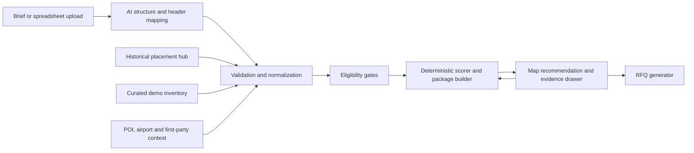

# Map-First Promotion Wizard MVP Design

**Status:** Approved interaction direction; written specification awaiting user review
**Date:** 2026-08-02
**Primary sectors:** FMCG, Real Estate, Bank/Fintech
**Primary outcome:** A defensible, adjustable OOH recommendation that culminates in a supplier-verification RFQ draft

## 1. Executive decision

Build a map-first planning experience that turns a short product brief into:

1. three recommended opportunity zones;
2. one recommended media package within budget;
3. a navigable explanation of why each zone and site was selected;
4. direct budget, zone and site adjustments; and
5. a supplier-grouped RFQ draft for rate, availability and compliance verification.

The first view stays intentionally sparse: one brief, one map, three zones and one package. Methodology, source evidence, inventory detail and RFQ content appear only after a click.

The recommendation engine is deterministic and evidence-led. AI extracts and structures briefs, maps spreadsheet headers, selects an appropriate planning preset and writes explanations from approved evidence. AI does not invent inventory, availability, reach, rates, market-share lift or performance outcomes.

## 2. Why this is the best MVP

Three product approaches were considered:

| Approach | Strength | Cost/risk | Decision |
|---|---|---|---|
| Dashboard and strategy workbench | Exposes all strategy and scoring controls | Too dense for a live demo; obscures the recommendation | Rejected |
| Map-first progressive disclosure | Creates an immediate visual answer while preserving evidence depth | Requires disciplined drawer states | **Approved** |
| Chat-first planning assistant | Familiar AI interaction | Harder to compare geography and adjust a media plan confidently | Retain only as optional brief input, not the primary UI |

The approved direction creates the highest demo value with the least build effort because the recommendation is visible immediately and every deeper element reuses one contextual drawer.

## 3. Source-hub findings

The Drive hub contains six relevant Office-format workbooks. They were inspected read-only.

### 3.1 Historical OOH sources

| Source | Canonical data area | Rows | Approximate distinct site keys | Important contents |
|---|---|---:|---:|---|
| [OOH Historical Data 2018–2023](https://docs.google.com/spreadsheets/d/1zTMMrbfM7LeYIlPs1tqENk9XmOeFUYda/edit) | `Sheet1` | 119,524 | 28,483 | Advertiser, geography, address, brand/category, board type, format, static/digital class, nominal rate, month/quarter/year |
| [OOH Industry Data, Full Year 2023](https://docs.google.com/spreadsheets/d/1Ox30GAOxvGMzZqMLAc15bRfhnRL8Bs0T/edit) | `DATA` | 40,096 | 13,416 | Same placement fields plus useful category, format, advertiser and board-type pivots |
| [OOH Industry Data, FY2024–Q1 2025](https://docs.google.com/spreadsheets/d/17S9-K74evgXkEDd8meOgiFjU98T9rSUE/edit) | `FY 24 - Q1 25` | 42,932 | 15,652 | Latest hub placement period (through Q1 2025), with the same 16-column shape |

The three canonical data areas contain 202,552 placement-month rows. The approximate site keys above are calculated within each workbook using normalized state, city, address, board type and static/digital classification; they must not be summed and treated as globally deduplicated inventory.

The history is particularly strong for the target sectors. Across the 2018–2023 source alone, category labels include 67,179 FMCG-proxy rows, 2,389 bank rows and 1,626 real-estate rows. The 2024–Q1 2025 source includes 15,418 FMCG-proxy rows, 1,356 bank rows and 1,336 real-estate rows. These counts indicate useful competitive-pattern depth, not audience reach or unique campaigns.

### 3.2 Airport sources

The `Airport Data` folder contains FAAN workbooks for 2023, 2024 and 2025. They provide monthly domestic and international passenger arrivals/departures by airport; the 2023 and 2024 files also contain aircraft, cargo and mail movements.

These records are useful for contextualizing airport opportunity and seasonality. They are not advertising impressions, unique visitors, terminal-zone footfall or audience profiles. The MVP may show them as `passenger movements` with year, month, direction, airport and FAAN provenance. Any conversion to average daily movement must disclose the calendar denominator and must not be called daily reach.

### 3.3 What the hub can and cannot support

The hub can support:

- competitive placement patterns by geography, category, brand, format and time;
- relative historical rate bands;
- observed placement-month persistence and burst patterns within the documented sources;
- category-format tendencies;
- observed placement gaps and concentration within documented source coverage; and
- analogue retrieval for similar campaign contexts.

The hub does not currently provide:

- stable structure, face or owner identifiers;
- coordinates or exposure-zone geometry;
- current availability or owner-confirmed prices;
- site photos, orientation, size, illumination or viewability inputs;
- permit and category-restriction status;
- traffic, OTS, LTS, audience, reach or deduplication methodology; or
- proof-of-posting/play and delivery status.

Therefore, historical placements must remain a separate evidence layer. They must never be silently promoted into bookable inventory.

### 3.4 Data-quality implications

The historical sources contain repeated monthly observations, spelling/case variation and near-duplicate addresses. The latest-period hub file also contains at least two shifted/malformed rows whose values appear under the wrong columns. The import layer therefore requires explicit schema mapping, data-type checks, anomaly detection, row quarantine and field-level provenance.

The stored `MONTHLY RATE` is often derived from `ANNUAL RATE / 12`. It is a nominal rate proxy and must not automatically be described as actual media spend, net cost or paid invoice value.

## 4. Product boundary

### 4.1 Included in the demo-friendly MVP

- A short structured brief with an optional free-text AI entry point.
- Sector templates for FMCG, Real Estate and Bank/Fintech.
- Lagos as the seeded demo market, with five candidate zones and a small curated demo-inventory sample.
- Three recommended zones and one recommended package.
- One contextual drawer for zone, site, evidence, methodology and RFQ states.
- Direct budget changes, zone replacement and site swap/remove actions.
- Transparent Planning Fit scoring and separate Evidence Confidence.
- Historical competitor/rate evidence from the hub.
- Live `.xlsx` or `.csv` upload for either inventory or first-party service/distribution locations.
- Supplier-grouped RFQ drafts for supplier verification, with copy/download actions and provenance-aware export controls.
- Three pre-seeded demonstration briefs, one per target sector.

### 4.2 Explicitly excluded

- Direct booking, payment, contracting or media-owner email delivery.
- Guaranteed availability or final pricing.
- Predicted sales, leads, ROI or market share.
- A national causal-demand simulator.
- Cross-channel reach/frequency deduplication.
- User-editable scoring weights in the default experience.
- A dashboard, strategy rail, KPI grid, radar chart or visible formula ledger on first load.
- Multi-user approval workflows and complex permissions.
- Live supplier, programmatic DOOH or proof-of-play integrations.
- Side-by-side plan comparison; the MVP explains one recommended package and its alternatives progressively.

## 5. Experience contract

### 5.1 Primary states

The interface has six explicit states:

1. **Brief ready:** Sector, Product, Priority audience, `Create recommendation`, and one dominant map with no implied recommendation.
2. **Generating:** The brief remains visible while named stages such as `Checking inventory`, `Scoring zones` and `Building package` replace the action. No fabricated percentage is shown.
3. **Recommendation loaded:** The map shows a sentence such as `Focus on Yaba/Akoka, Ikeja and VI/Ikoyi`, three numbered recommended zones, muted alternatives, one package strip with asset count, owner count, indicative cost and a clickable Planning Fit/Confidence value, a budget control, `How was this chosen?`, `Adjust sites` and `Review RFQ`.
4. **Draft changed:** The recommendation view remains intact, changed elements are marked, and a small `What changed?` action appears.
5. **Active customised:** Applying a valid draft clears the dirty state, keeps an `Original recommendation` reset path and marks the package as customised.
6. **Generation failed:** The populated brief and last valid recommendation, when one exists, remain available with a concise failure reason and retry action.

No scorecard or evidence panel is open by default in any state.

The compact brief shows only sector, product and audience. Sector templates supply visible default assumptions for objective, Lagos geography, working budget and flight duration. `More options` exposes objective, geography, exact budget and dates without expanding the default view. A recommendation may be explored with assumed dates, but RFQ generation requires explicit date confirmation.

### 5.2 Progressive disclosure

All depth uses one drawer so the map remains visible.

| Trigger | Drawer state | Required content |
|---|---|---|
| Click recommended zone | Zone detail | Rank, one-sentence rationale, three evidence reasons, two or more suggested inventory faces, `Exclude zone`, `View evidence` |
| Click alternative zone | Alternative detail | Trade-off, supporting evidence, candidate sites, `Use this zone` |
| Click or choose a site | Site detail | Face ID, owner, format, location, provenance/as-of dates, indicative rate, availability/permit state, role in plan, `Swap` or `Remove` |
| Click `View evidence` | Evidence trail | Input value, metric basis, period, source, transformation, confidence and limitations |
| Click Planning Fit or `How was this chosen?` | Method | Formula, preset/version, five pillar weights, Planning Fit, Evidence Confidence and interpretation |
| Click a method pillar | Pillar contribution | Effective contribution, compatible metric mode, relevant zones and any unscored component |
| Click `Review RFQ` | RFQ review | Campaign summary, zones, selected faces, internal-only working budget by default and supplier confirmation requests |

The drawer has Back, Close and breadcrumb behavior. Escape closes it. Hover may cross-highlight map and list items, but every action is available by click and keyboard.

The exact five-click confidence path starts from the package strip and stays inside this drawer: `Planning Fit (1) → pillar (2) → zone (3) → site (4) → evidence/source record (5)`. Each level shows only the evidence relevant to the clicked item, and the final record exposes source owner, period, transformation, quality flags and source link or snapshot. `How was this chosen?` opens the same Method state. Breadcrumbs allow users to move back without losing the map selection.

### 5.3 Adjustments

The MVP supports only the adjustments that visibly improve the plan without becoming a planning workbench:

- change working budget;
- exclude one recommended zone and promote the best eligible alternative;
- choose an alternative zone to replace the lowest-ranked selected zone;
- swap or remove a site, except that `Remove` is disabled when it would leave a selected zone without a face; that state offers `Swap` or `Exclude zone`; and
- reset to the original recommendation.

Every adjustment creates a dirty draft from the current active package. The map, recommendation sentence, package count/cost and RFQ preview update together. `What changed?` shows both current-active → dirty-draft deltas and cumulative original → dirty-draft deltas for Planning Fit, Evidence Confidence, cost, selected zones/faces and only the pillar contributions affected by the action. It states the causal action, for example `Budget reduced; two premium faces removed`, rather than implying predicted campaign impact.

The drawer offers `Undo last change`, `Apply draft` and `Reset to original`. Applying clears the dirty draft, creates the `Active customised` state and makes that package the RFQ basis; the immutable original remains the cumulative comparison/reset target. Subsequent edits start from the active customised package. Invalid drafts retain the last valid scores and package, identify the blocking field or gate, and disable RFQ progression.

While a valid dirty draft exists, the primary RFQ action is labeled `Apply & review RFQ`. It atomically applies that draft and then opens RFQ review using only the active customised package. If validation fails, nothing is applied and the dirty draft remains available for correction.

### 5.4 Live upload

`Upload spreadsheet` is available beside the brief and from the adjustment drawer. The user chooses one of two MVP templates:

1. **Inventory:** current sites/faces, owners, coordinates, formats, rates and availability.
2. **Service/distribution locations:** stores, branches, ATMs, agents, merchants, project location or other first-party points that constrain where the product can be bought or served.

Import flow:

1. Choose `.xlsx` or `.csv`.
2. Select the data sheet when an `.xlsx` contains more than one plausible table.
3. Auto-map headers to the canonical schema.
4. Show required, mapped, ignored and invalid fields plus a ten-row preview.
5. Quarantine invalid rows; never silently drop or coerce them.
6. Confirm import.
7. Show the new map layer and recalculate affected recommendations as a reversible dirty draft.

Header mappings below 80% model confidence require explicit user confirmation. Inventory imports require a source face ID, owner/seller, coordinates or a geocodable address, format, static/DOOH classification, rate, currency, gross/net status, rate basis, availability window, source artifact/dataset and `rate_as_of`. The system assigns an internal UUID and namespaces the supplied ID to the import dataset. A missing permit or fresh-photo field is allowed only as an explicit conditional/unknown state.

Service/distribution imports require a source location ID, type, coordinates or address, status, weight and source artifact/dataset; validity dates are optional but recommended. The user chooses `Context only` or `Eligibility constraint`. Eligibility mode requires a supplied polygon or an explicit `service_radius_m` column/value shown at confirmation; the system never invents or silently buffers a point. The seeded upload fixture uses a disclosed 2 km radius stored as a user-provided planning assumption, not an exposure zone.

Before confirmation, the uploader records data purpose, rights to use and the §8.4 privacy classification. Confirming an upload after a recommendation exists creates a reversible dirty draft rather than silently replacing the baseline. `What changed?` names the dataset revision, affected rows, service geometry/rule and the gates or score inputs that changed.

The demo's strongest upload moment is a distribution/service-location file: the map gains the first-party locations, zones outside the serviceable catchment become conditional or ineligible, and the three recommendations visibly change.

## 6. Sector templates

The sector template supplies terminology, context signals, regulated-category checks and default weights. A user-selected campaign objective overrides sector weights.

| Sector | Default objective | High-value first-party input | Contextual enrichment | Important guardrail |
|---|---|---|---|---|
| FMCG | Launch / availability | Stocked outlets, weighted distribution, stock status | Supermarkets, markets, campuses, commuter and leisure contexts | Media cannot compensate for unavailable product |
| Real Estate | Consideration / enquiries | Project coordinates, price band, property type, target buyer catchment | Workplaces, affluent residential areas, airports, premium retail and feeder corridors | Do not describe enquiries or sales as predicted without response data |
| Bank/Fintech | Trust / adoption | Serviceable geographies, branch/ATM/agent/merchant footprint, eligibility rules | Workplaces, campuses, commerce, transport hubs and finance contexts | Booking remains conditional on product and creative compliance |

## 7. Recommendation method

### 7.1 Sequence

1. Normalize the brief and source data.
2. Apply preliminary non-confidence, non-budget gates.
3. Stabilize and freeze the normalization cohort, D/E modes and Evidence Confidence.
4. Apply the campaign-budget gate; compute face features/scores.
5. Rank faces inside each zone and retain up to four deterministic candidates.
6. Compute candidate-zone reducers and score zones for the stated objective.
7. Build candidate packages within budget.
8. Recompute Planning Fit at package level.
9. Return the best-fit package, two package alternatives internally and up to three selected zones visually.
10. Generate explanation facts from the deterministic result.
11. Allow AI to express only those facts in plain language.

Site scores may help rank inventory within a zone, but they are never added together and presented as campaign performance. Package-level Planning Fit is recomputed because catchment coverage, contextual mix and competitive alignment change with each selection. Supplier/format concentration is disclosed as a package trade-off but is not silently added to a pillar. Audience coverage or overlap is shown only when a validated reach model supplies its basis and uncertainty.

### 7.2 Planning Fit

`Planning Fit = Σ (pillar score × objective weight)`

All pillar scores are 0–100. Weights sum to 100%.

The pillars operationalize the standard objective-led planning sequence: define the target and job to be done, qualify available delivery, test context and timing, construct a complementary portfolio, then assess economics. Industry measurement standards govern the inputs and claim labels; the combined score and weights remain a transparent product-defined decision aid, not a certified industry rating or outcome probability.

| Pillar | MVP interpretation |
|---|---|
| Strategic alignment (A) | Target match plus objective/format match |
| Audience suitability/delivery (D) | One explicit, homogeneous delivery mode for the whole ranked cohort |
| Context and timing (C) | Purchase/service context, catchment fit and requested time coverage |
| Portfolio and competition (P) | Geographic gap closure plus chosen whitespace/conquest logic |
| Economics (E) | Basis-labeled CPM when genuinely compatible exposure exists; otherwise a period-compatible rate position |

All five top-level pillars are required for a numeric Planning Fit. If any pillar cannot be supported, the interface shows `Planning Fit: insufficient evidence` and does not silently inflate the other pillars by renormalizing them. An optional subcomponent inside a valid pillar may be omitted only when the method definition permits it; its effective weights and omission are then shown. A fabricated zero or neutral value is never substituted.

Suggested component formulas:

- `A = 0.60 × TargetMatch + 0.40 × ObjectiveMatch`
- `C = 0.70 × ZoneContextFit + 0.30 × TimingFit`
- `P = 0.70 × GapClosure + 0.30 × CompetitionAlignment`

Numeric cohort values use `PR(x) = 100 × (midrank(x) − 1) / (N − 1)`; when `N = 1`, `PR(x) = 50`. Lower-is-better measures use `100 − PR(x)`.

At baseline generation, the engine persists a `normalization_cohort_id`, dataset revision, final member IDs, filters and stabilization trace for the brief's sector, geography and dates. Percentiles never use only the currently visible/selected items. Budget, zone and site drafts reuse the frozen cohort/modes even when selections are removed; a confirmed upload runs stabilization again and creates a draft with a new named cohort revision, which `What changed?` discloses. Changing sector, geography or dates generates a new baseline.

D-mode selection is deterministic: the method takes the first mode for which every ranked cohort member has a compatible valid input in the fixed order `D_Audience → D_LTS → D_OTS → D_ContextProxy`. The chosen mode and input definition are frozen on the cohort. If no common mode exists, D and Planning Fit are not scored.

E-mode selection is also frozen for the run. Use `E_CPM` only when every cohort face has compatible cost and impression inputs for the chosen D basis plus a valid format-specific cohort. Otherwise use `E_RatePosition` only when every cohort face has compatible rate inputs and a valid format-specific rate cohort. If neither condition holds, E and Planning Fit are not scored. A package never mixes CPM-backed and rate-position-backed face scores.

`TargetMatch`, `ObjectiveMatch` and the separate `ContextTargetFit` catalog use documented mappings of strong/high `100`, moderate/medium `60` and weak/low `20`. A tag without a source record is not scoreable.

For face `i` in zone `z`, `A_i = 0.60 × TargetMatch_z + 0.40 × ObjectiveMatch_i`. The brief/template supplies context tags `k` and positive importance weights `w_k` that sum to 1; `ZoneContextFit_z = Σ(w_k × ContextMatch_zk)`, using the documented 100/60/20 catalog. Every weighted tag needs an evidence record or C is not scored.

Timing uses the requested date × daypart planning units. `AvailabilityCoverage_i = 100 × available_requested_units_i / requested_units`. If a source-backed season/event/daypart match exists, `TimingFit_i = 0.70 × AvailabilityCoverage_i + 0.30 × SeasonalAlignment_i`, where Seasonal Alignment uses 100/60/20. Otherwise `TimingFit_i = AvailabilityCoverage_i` with effective weights 100%/0%. `C_i = 0.70 × ZoneContextFit_z + 0.30 × TimingFit_i`.

For A and C reducers, a qualified OTS/LTS/Audience mode uses compatible basis-impression shares within each zone and then across zones. `D_ContextProxy` uses equal face weights inside each zone and equal selected-zone weights, preventing face count from manufacturing fit. Zone scores use the retained `R_z` faces defined in §7.6; package scores use only selected faces. These exact reducer weights are stored with the result.

The D pillar is versioned and visibly labeled as exactly one of:

- `D_OTS`: delivery from qualified opportunity-to-see estimates;
- `D_LTS`: delivery from qualified likelihood-to-see estimates;
- `D_Audience`: delivery from a qualified audience estimate; or
- `D_ContextProxy`: source-backed contextual target fit when no qualified delivery estimate exists.

`DeliveryScore` is `PR(compatible target exposure)` within the frozen normalization cohort, or `100 × min(qualified reach / reach_goal, 1)` when a validated unique-reach method and explicit goal exist. `D_mode` is the enum above; the numeric output is `D_score`.

`FrequencyFit` is allowed only when the same validated unique-audience method supplies package average frequency `f` and the user supplies `0 < f_min ≤ f_max` for the same target, universe, geography and period:

- `100` when `f_min ≤ f ≤ f_max`;
- `100 × f / f_min` when `f < f_min`; and
- `100 × f_max / f` when `f > f_max`.

With that input, `D_score = 0.70 × DeliveryScore + 0.30 × FrequencyFit`. Otherwise `D_score = DeliveryScore`, the effective weights are shown as 100%/0%, and the product never assumes a universal `3+` rule. `D_ContextProxy` uses a source-backed `ContextTargetFit` catalog that is distinct from A's target/objective mappings, is labeled `context proxy` everywhere, and caps Evidence Confidence at grade C.

Every candidate in one ranking run must use the same D mode, metric definition, population unit, target/universe, period/daypart, geography and normalization cohort. The engine never ranks an OTS-backed candidate against a contextual proxy under the same 0–100 D score. If a homogeneous cohort cannot be formed, D and therefore Planning Fit are not scored.

`GapClosure = 100 × Σ(weight_c × covered_c) / Σ(weight_c)` over versioned priority catchment cells, where `covered_c` is 1 only when at least one selected face's explicit `planning_coverage_geometry` covers cell `c`. That geometry is a reviewed zone polygon or an uploaded polygon/disclosed buffer; a face point never creates coverage by itself. The drawer names the numerator, denominator, geometry, source and date. Without a validated priority layer, configured opportunity zones receive equal weight, the result is labeled `geographic proxy`, and Confidence is capped at C.

`CompetitorIntensity_z = relevant placement-month rows in zone z / documented source-covered months` for one frozen category/competitor definition and lookback window. Its PR cohort is the frozen eligible-zone set; missing zone coverage makes the component unscored. Under whitespace, zone alignment is `100 − PR(CompetitorIntensity_z)`; under conquest it is `PR(CompetitorIntensity_z)`. `CompetitionAlignment_package` is the equal-weight mean of selected-zone alignment scores, so adding faces inside a zone cannot change it. Then `P = 0.70 × GapClosure + 0.30 × CompetitionAlignment_package`. Under a neutral strategy, `P = GapClosure` with effective P subweights shown as 100%/0%. Observed placement counts are called competitive activity, not share of voice.

When the denominator is compatible, `BasisCPM_i = 1,000 × Cost_i / BasisImpressions_i` and `E_i = 100 − PR(BasisCPM_i)` within face `i`'s compatible format cohort. The interface names the denominator explicitly—for example `OTS CPM`, `LTS CPM` or `Audience CPM`—and never displays generic `Target CPM`.

CPM compatibility requires the same metric definition and basis, person/proxy unit, target and universe, period/daypart, geography, model/source quality, currency, gross/net price status, included taxes/production and price vintage. In frozen `E_RatePosition` mode, `E_i = 100 − PR(Rate_i)` only within a compatible city, format, rate period and rate-basis cohort. In either mode, `E_package = Σ((Cost_i / TotalCost) × E_i)`, so mixed-format packages are comparable only after each face is normalized inside its own compatible format cohort. If any selected face lacks the frozen mode/cohort, E and Planning Fit are not scored. Owner-confirmed, time-aligned offers may be labeled `relative rate efficiency`; unnormalized hub rates are labeled `historical nominal rate position` and never imply a current buying price.

### 7.3 Presets

Sector defaults:

| Preset | A | D | C | P | E |
|---|---:|---:|---:|---:|---:|
| FMCG launch / availability | 20% | 35% | 20% | 15% | 10% |
| Real-estate consideration | 30% | 15% | 30% | 15% | 10% |
| Bank/fintech trust / adoption | 30% | 25% | 20% | 15% | 10% |

Objective overrides:

| Objective | A | D | C | P | E |
|---|---:|---:|---:|---:|---:|
| Awareness / launch | 20% | 35% | 15% | 20% | 10% |
| Consideration / trust | 30% | 20% | 25% | 15% | 10% |
| Action / leads | 25% | 15% | 35% | 10% | 15% |

These are `OOH DataHub planning presets`, not an industry standard or certification. The default UI does not expose weight editing.

### 7.4 Eligibility gates

The preliminary set `S0` excludes a face when any non-confidence gate fails:

- inactive or unavailable for the campaign dates;
- outside selected geography or a required service/distribution catchment;
- missing/non-positive price;
- missing face ID, coordinates, owner, format or rate basis;
- a known physical-site permit failure, brand-safety failure or sector restriction.

Confidence and mode selection then use a deterministic shrinking fixed point:

1. On current set `S_t`, select common D and E modes using the fixed orders and schema/qualification rules, without using the Q threshold.
2. If no common modes exist, stop with `Planning Fit: insufficient evidence`.
3. Compute all essential feature and face-scope Q inputs needed for cohort eligibility under those modes; zone/package Q is computed later from frozen members.
4. Set `S_(t+1)` to members of `S_t` with Q ≥ 40 and no missing essential numeric/gating input.
5. If membership and modes are unchanged, freeze the cohort and compute final percentiles; otherwise repeat from step 1.

Faces are never added during stabilization, so the process terminates after at most `|S0|` removals. The stored trace lists each removal reason and any mode change. After freezing, a face priced above the total campaign budget is ineligible for the current package but remains in the normalization cohort, so a budget adjustment cannot renormalize every score. Remaining-budget checks occur only during package validation or after the user locks selections.

An unknown or pending physical-site permit may be explored only as conditional inventory and is never called verified or bookable. A known site-permit rejection is a hard failure. Creative approval is tracked separately: an RFQ may be prepared while approval is pending, but a media-order or exposure/delivery status is blocked until the exact creative version has the required ARCON ASP Certificate of Approval and any prerequisite sector-regulator approvals.

### 7.5 Evidence Confidence

Confidence is separate from Planning Fit and never multiplied into it.

Each `method_version` includes a `quality_rule_registry` entry per feature: `required_field_ids`, a deterministic `required_subject_query`, `essential_for` (`gate | score | cost`), freshness SLA, expected granularity, allowed validation states and provenance caps. Cohort creation resolves and snapshots the required subject UUIDs. `CoveragePct` always uses that frozen set, not the rows that happen to be populated. The plan persists `essential_feature_ids`; optional evidence that affects no gate, score or cost is excluded from Q.

MVP feature requirements are:

| Feature | Required fields | Required subjects | Default temporal rule |
|---|---|---|---|
| Identity/eligibility | namespaced ID, owner, coordinates/accuracy, format/class, operating status, source/effective time | every normalization-cohort face | identity/status reviewed within 365 days |
| Price/E | currency, amount, gross/net state, rate basis, inclusions/taxes, `rate_as_of`, format cohort | every cohort face for E-mode selection; every selected face for package cost | 30 days for an unconditional current label; exact source period for historical position |
| Availability/timing | status, window, as-of time and requested date × daypart units | every selected face and every face used in candidate-zone timing | owner-confirmed within 7 days for an unconditional label |
| A/C context | catalog/version, subject/tag, match level, importance weight, source and effective period | every weighted tag for every ranked zone | catalog/source reviewed within 365 days |
| D delivery | all mode-specific §8.2 qualification, universe, period, unit, method and uncertainty fields | every face/zone in the frozen D cohort | effective within 365 days or validated seasonal match |
| P coverage/competition | geometry/version/source, priority-cell weights; category/competitor definition, placement rows, covered months and lookback | all priority cells and every eligible-zone cohort member | geometry within 730 days; competition exact lookback, and within 365 days when labeled current context |

Site permit, photo and creative-approval freshness follow §8.4 and affect conditions/RFQ readiness; they enter Q only when a method version explicitly uses them in a hard gate or numeric feature.

`Q = 0.25 × SourceFitness + 0.25 × Validation + 0.20 × TemporalAlignment + 0.20 × GranularityCoverage + 0.10 × Completeness`

Each component uses this versioned 0–100 lookup:

| Component | Deterministic score |
|---|---|
| `SourceFitness` | 100 claim-specific authoritative/contracted source with immutable artifact; 75 first-party/provider source fit for the claim; 50 disclosed modeled/secondary source; 25 analogue, inferred or demo source; 0 unknown/incompatible |
| `Validation` | 100 independent audit or observed ground-truth check; 75 independent reconciliation/calibration with disclosed test; 50 provider QA with method; 25 schema/range checks only; 0 none |
| `TemporalAlignment` | 100 meets the field SLA and campaign/season period; 75 no more than 2× the SLA or validated seasonal match; 50 no more than 4×; 25 older/misaligned but dated; 0 no usable period |
| `GranularityCoverage` | `0.60 × G + 0.40 × CoveragePct`, where G is 100 for face/daypart, 75 for face/period or zone/daypart, 50 for zone/period, 25 for market-level and 0 incompatible; `CoveragePct = 100 × valid required subjects / required subjects` |
| `Completeness` | `100 × valid populated required fields / required fields`; a required uncertainty/method field counts as missing |

`metric_basis` is reported separately and never earns confidence merely for sounding more sophisticated.

For each scored feature, Q uses the weakest directly contributing evidence record. Pillar Q is the effective-subcomponent-weighted mean of its feature Q values. `Q_raw` is the objective-weighted mean of the five pillar Q values; `Q_min` is the minimum essential feature Q used for an eligibility gate, score or cost. At face, zone or package scope, `Q_final = min(Q_raw, Q_min + 15, applicable provenance/method caps)`. This prevents a critical weak source from being averaged away while remaining reproducible.

Caps are mandatory: no independent validation caps Q at 84; supplier self-attestation alone cannot exceed 84; `D_ContextProxy` caps it at 69; any demo/synthetic input essential to the result caps it at 54. A missing source, period or method on an essential numeric/gating input makes the result unranked rather than assigning a neutral score; explicitly permitted conditional fields such as an unknown site permit remain conditions, not fabricated inputs.

| Grade | Score | Meaning |
|---|---:|---|
| A | 85–100 | Time-aligned, granular evidence with independent audit/validation or independently observed ground truth |
| B | 70–84 | Time-aligned provider-confirmed evidence with disclosed method and validation; supplier attestation alone cannot exceed B |
| C | 55–69 | Area-level or modeled data with assumptions and uncertainty disclosed |
| D | 40–54 | Stale, inferred, synthetic/demo or materially incomplete |
| Unranked | Below 40 | Insufficient evidence for a scored recommendation |

Every explanation shows Planning Fit, Confidence, preset/version, D mode, normalization cohort, strongest reasons, main trade-off, measurement basis, source period and assumptions.

### 7.6 Deterministic face and zone ranking

For each eligible face `i`, `GapPotential_i` uses the same priority-cell equation as Gap Closure but only that face's explicit planning geometry. `P_i = 0.70 × GapPotential_i + 0.30 × CompetitionAlignment_z`, or `P_i = GapPotential_i` in neutral mode. `FaceFit_i` applies the active five-pillar preset to `A_i`, `D_score_i`, `C_i`, `P_i` and `E_i`.

Within each zone, scored faces sort by `FaceFit_i` descending, `Q_i` descending, price ascending and face UUID ascending. The first four are the retained face set `R_z`. An eligible but unscored face remains inspectable as conditional inventory but cannot displace a scored face; if no complete scored set can form a package, the result is `Planning Fit: insufficient evidence`.

Candidate-zone reducers use `R_z`:

- `A_z` and `C_z` use the reducer weights defined in §7.2;
- in OTS/LTS/Audience mode, `D_z = Σ(BasisImpressions_i / Σ BasisImpressions_Rz × D_score_i)`; in context-proxy mode, `D_z = ContextTargetFit_z`;
- `E_z = Σ(Cost_i / Σ Cost_Rz × E_i)`;
- `GapPotential_z` applies the priority-cell equation to the union of `R_z` planning geometries; and
- `P_z = 0.70 × GapPotential_z + 0.30 × CompetitionAlignment_z`, or `P_z = GapPotential_z` in neutral mode.

`ZoneFit_z` applies the active five-pillar preset to A_z, D_z, C_z, P_z and E_z. Zones sort by Zone Fit descending, zone Q descending, minimum retained-face price ascending and stable zone ID ascending. The selected package's zones appear as recommendations in this order; non-selected zones appear as alternatives in zone-rank order.

### 7.7 Deterministic demo package builder

The MVP uses five versioned, human-reviewed Lagos planning polygons; AI does not invent or redraw zones. Face membership is determined by point-in-polygon after geocoding validation.

For the small demo inventory, the builder uses the retained face sets from §7.6, enumerates valid three-zone packages of three to eight faces with at least one face per selected zone, and rejects any package above budget or failing a hard gate. If fewer than three zones are eligible, it uses the truthful eligible count. These limits are method-version parameters, not universal media-planning rules.

Package features are recalculated rather than summed from site scores. A and C use exposure-weighted face/zone inputs when one compatible delivery basis exists, otherwise equal zone weights are disclosed in context-proxy mode. For OTS/LTS/Audience modes, D is the basis-impression-weighted mean of face D scores unless a validated package unique-reach/frequency model permits direct recomputation; `D_ContextProxy` uses equal selected-zone weights so adding more faces cannot manufacture target fit. E uses the cost-share-weighted cohort-normalized formula in §7.2. P recalculates gap closure and competitive alignment for the complete package. Supplier/format concentration remains a visible trade-off, not an unlisted score term.

For each package, `canonical_face_tuple = join(sort(face_uuid ascending), "|")`. Valid packages sort by Planning Fit descending, Evidence Confidence descending, cost ascending and `canonical_face_tuple` ascending as the final tie-break. The winner is shown; the next two remain internal candidates for replacements. The MVP does not expose a side-by-side comparison screen.

## 8. Canonical data model

Historical observations, supplier inventory/offers and measurements are deliberately separate. An internal UUID is the primary key for every entity. External identity is namespaced as `{source_system, source_entity_id}`; an uploaded `face_id` is never assumed to be globally stable.

### 8.1 Core entities

| Entity | Purpose | Minimum fields |
|---|---|---|
| `source_artifact` | Lineage for a file, API snapshot, audit, owner attestation or delivery log | Internal UUID, type, name/URI, source owner, retrieved time, effective period, checksum/snapshot ID |
| `source_dataset` | Coverage, rights and governance | Internal UUID, artifact IDs, owner, geography/period, usage rights, purpose, privacy classification, quality flags |
| `import_job` | Upload workflow and quality record | Type, status, mapping, accepted/rejected counts, validation report |
| `historical_placement` | Competitive/rate observation | Advertiser, brand/category, geography/address, format, classification, nominal rate/basis, month/year, source row |
| `inventory_face` | Canonical supplier-request unit | Internal UUID, source system/face ID, structure ID, owner/seller, lat/lon, coordinate accuracy, address, format/dimensions, orientation, static/DOOH, photo/date, status |
| `inventory_offer` | Time-bound trading data | Face UUID, availability window, currency, rate, gross/net status, rate basis, inclusions/taxes, production/installation cost, minimum buy, `rate_as_of` |
| `site_permit` | Time/versioned physical-site authorization | Face/structure UUID, authority, permit number/status, issue/expiry/check dates, restrictions and evidence |
| `creative_approval` | Approval for an exact creative version | Creative checksum/version, sector-prerequisite approvals, ARCON status, ASP certificate number/date, restrictions and evidence |
| `delivery_observation` | What was posted, played or aired | Subject/content IDs, scheduled and actual delivery, play/share-of-time or posting state, period, proof and source |
| `movement_observation` | Movement or presence before exposure qualification | Subject/geography, metric name, vehicles/devices/passenger movements/footfall, gross-or-unique flag, period/daypart, collection method and source |
| `exposure_estimate` | Qualified OOH Gross/OTS/LTS/Audience estimate | Subject, metric basis, value/unit, target/universe, period/daypart, qualification, derived-from IDs, method/version and uncertainty |
| `audience_profile` | Segment composition | Subject ID, segment, share/index, age/income/occupation/student or visit-purpose band where supplied, universe, sample/coverage, period and source |
| `context_point` | POI or first-party location | Type, name, lat/lon, weight, service/stock status, validity dates and source |
| `planning_coverage_geometry` | Explicit non-exposure geometry for gap/service logic | Subject ID/type, polygon or disclosed buffer parameters, geometry version, purpose, source/assumption and validity dates |
| `campaign_brief` | User intent | Sector, product, objective, audience, geography, budget, dates and constraints |
| `normalization_cohort` | Frozen ranking population | Brief/data revision, method version, D/E modes, preliminary filters, final member UUIDs, stabilization trace and creation time |
| `recommendation` | Immutable baseline plan | Brief ID, method/version, normalization cohort, D mode, zones, faces, costs, score state, confidence and explanation facts |
| `recommendation_draft` | User adjustments | Baseline ID, ordered actions, recalculated output, deltas and validation state |
| `rfq` / `rfq_line` | Supplier-verification request | Campaign terms plus selected face, owner, dates, confirmation fields and export classification |
| `evidence_record` | Field-level derivation lineage | Entity/field, raw/transformed value, source owner/link, collected/retrieved/effective times, raw-observation IDs, transformation expression, model/version, validation, quality flags and uncertainty |
| `standards_registry` | Versioned measurement definitions | Medium, metric/stage, governing standard, version/effective date, qualification rules and source link |
| `quality_rule_registry` | Reproducible confidence dependencies | Method/feature version, required fields/subject query, essential use, SLA, granularity, allowed validations and caps |

### 8.2 OOH exposure contract

Delivery, movement and exposure are different record types linked by `derived_from_ids`, transformation/model version and uncertainty. `plays` belongs in delivery; `vehicles`, `devices`, `passenger_movements` and unqualified footfall belong in movement. None is automatically an exposure unit.

An OOH `exposure_estimate` stores metric basis, population unit, person-or-proxy status, gross-or-unique status, value, geography/direction, target/universe, period/daypart, display/content scope, source collection window, occupancy/dwell/viewability assumptions, qualification standard/version/thresholds, model/version, uncertainty and derivation lineage.

Qualification gates:

- `traffic` or circulation remains a movement measure and is never called audience.
- `Gross` is accepted only with its governing OOH definition, qualified unit and scope; otherwise the native movement label is retained.
- `OTS` requires a functional display, presence in the defined exposure zone and the stated OOH viewability condition.
- `LTS` requires the OTS conditions plus empirically supported evidence or probability that the display was noticed/seen.
- `Audience` requires a stricter qualified-person measure with its target/universe, gross-or-unique basis and validation disclosed.
- A DOOH ad impression additionally requires actual ad play/share-of-time and any applicable dwell threshold; proof-of-play alone proves delivery, not human viewing.
- Passenger arrivals/departures remain movements, not unique people, views or impressions.
- Devices remain people-surrogates unless a validated conversion is disclosed.
- Reach/unique audience requires a disclosed, validated and privacy-safe method for estimating unique persons and duplication, including universe, period, error and deduplication scope.

An import cannot self-label traffic as OTS, LTS or Audience unless the required qualification fields pass validation. CPM compatibility follows the full rules in §7.2.

### 8.3 Neutral cross-media measurement contract

Future media adapters map native records into a neutral supertype with:

- `medium`, `metric_name` and `measurement_stage` (`delivery | opportunity | likely_exposed | audience | outcome`);
- `population_unit` and `proxy_or_person`;
- `gross_or_unique`, content/ad scope and duration/qualification threshold;
- target/universe, geography/coverage, period/daypart and deduplication scope;
- value, uncertainty and method/transformation version;
- governing standard/version and complete provenance.

Adapters are planned for:

- supermarket or retail screen/activation;
- university/hostel posterboard;
- airport or transport venue;
- radio station/program/slot; and
- micro-influencer/content package.

Every adapter also provides identity, location or coverage, availability, price/rate basis, audience profile where valid, restrictions, evidence and supplier/RFQ fields. A radio listener, creator view or passenger movement keeps its native, standard-governed meaning and is never forced into OOH `traffic/Gross/OTS/LTS`.

### 8.4 Governance, lineage and freshness

For every dataset, store processing purpose, personal-data classification, lawful basis, controller/processor, retention/deletion date, access scope, DPIA status, aggregation/small-cell rule and cross-border/processor restrictions. Raw device IDs, face recognition and individual movement trails remain outside scope. Uploaded first-party data inherits the same controls; upload permission does not imply unrestricted reuse.

MVP operational freshness defaults are versioned product rules, not industry standards:

| Field | Freshness rule for an unconditional planning label |
|---|---|
| Identity, ownership and operating status | Reviewed/confirmed within 365 days |
| Availability | Owner-confirmed within 7 days and covering the requested flight |
| Price and inclusions | Owner-confirmed within 30 days and explicitly time-bound |
| Site photo/condition | Captured or confirmed within 90 days |
| Site permit | Checked within 30 days and valid through the requested flight |
| Traffic/audience model | Effective period within 12 months or a disclosed seasonal match |
| Context catalog/POI | Reviewed within 365 days |
| Planning geometry/roads/boundaries | Reviewed within 730 days |
| Competitive placement context | Exact declared lookback; source must end within 365 days to use a current-context label |
| Service/stock status | Client-defined SLA, otherwise the MVP default is 30 days |

Stale fields may support exploration and a supplier-verification request but are marked conditional and cannot be presented as current/confirmed. The hub's latest period ends in Q1 2025; it is historical context in an August 2026 demo. Demo rates always show `illustrative demo rate as of <date>`.

## 9. Enrichment strategy

### 9.1 Highest value for the least effort

| Priority | Enrichment | Demo value | Effort |
|---:|---|---:|---:|
| 1 | Address cleanup, face deduplication, stable IDs and field-level provenance | Very high | Low |
| 2 | Geocoding plus state/LGA/zone assignment | Very high | Low–medium |
| 3 | Owner-confirmed rate, availability, fresh site photo and permit/authorization status | Very high | Low–medium |
| 4 | First-party outlets, branches, ATMs, agents, merchants or project location upload | Very high | Low |
| 5 | Road class, direction, POI/land-use and catchment context | High | Low |
| 6 | Observed historical competitor concentration, placement persistence and format mix | High | Low; source hub already exists |
| 7 | Time-stamped traffic/footfall and daypart profiles | Very high | Medium |
| 8 | Orientation, view angle, obstruction, dwell and exposure-zone geometry | Very high | Medium |
| 9 | Privacy-safe audience composition and cross-face reach deduplication | High | High |
| 10 | Nigeria-specific LTS/attention calibration | Very high | Very high |
| 11 | Sales, footfall or brand-lift attribution | Medium–high | Very high; post-MVP |

### 9.2 Broader enrichment option map

An enrichment enters the roadmap only if it can change an eligibility gate, score component, confidence grade, evidence explanation or RFQ field. Every derived feature names that decision use; interesting-but-inert data is not loaded into the MVP.

| Class | Candidate sources/features | Decision value | Main guardrail |
|---|---|---|---|
| Supply and trading | Owner inventory, fresh photos, maintenance, illumination, availability, rate cards, negotiated offers, production/installation and lead times | Turns exploration into a confirmable supplier request | Owner, as-of date, gross/net basis and inclusions are mandatory |
| Geospatial context | Geocoding, road hierarchy/direction, administrative areas, POIs, land use, travel time, pedestrian network, flood/roadwork and safety constraints | Builds zones, catchments, context fit and route logic | Geocoding confidence and boundary vintage remain visible |
| Population and audience | Official population/household/labour data, income bands, surveys/panels, privacy-safe audience aggregates | Improves target/context suitability | Area demographics are not claimed as people who viewed a face |
| Mobility and exposure | Traffic counters, vehicle class/speed, pedestrian counts, dwell, orientation, view cone, obstruction, telecom/mobile aggregates and reach models | Supports OTS/LTS/Audience modes and daypart planning | Must pass §8.2 qualification, privacy and compatibility gates |
| Commerce and distribution | Client outlets/stock, branches, ATMs, agents, merchants, card aggregates and retail scanner data | Exposes where purchase/service is possible and where media is wasted | Availability/stock observations need dates; media does not substitute for distribution |
| FMCG demand context | Retail density, category sales, price/affordability, purchase occasions, markets, supermarkets, campuses and event calendars | Improves launch/availability context and analogue retrieval | Aggregates do not reveal individual purchases |
| Real-estate demand context | Project location, price band, inventory, listing/search interest, employment centres, commute times, mortgage context and airport/diaspora proxies | Connects project proposition to plausible buyer catchments | Search/listing interest is not a lead or sale forecast |
| Bank/fintech access context | Branch/ATM/agent/merchant coverage, mobile connectivity, financial-access aggregates, workplaces, campuses and eligibility/service rules | Prevents promotion outside serviceable or usable markets | Device/connectivity and account eligibility are distinct |
| Competition and creative | Hub placements, creative/category coding, duration, format mix, rate pressure, search/social interest and creative tests | Supports documented activity, whitespace/conquest logic and message relevance | Source absence is not market absence; activity is not share of voice |
| Time and external conditions | Seasonality, weather, holidays, school terms, events, airport movements, road disruption and local trading hours | Improves timing and conditional opportunity | Period and geography must align; passenger movements remain movement |
| Delivery and outcomes | DOOH schedules/uptime/proof-of-play, posting audits, radio spot logs, brand lift, footfall, leads, sales and experiments | Verifies delivery and later enables causal evaluation | Delivery is not exposure; observational outcomes are not automatically causal |
| Future media | Radio coverage/program data, retail-media logs, creator audience/brand-safety/fraud signals, university/hostel and venue footfall | Extends the same workflow beyond classic OOH | Each adapter retains its native metric standard and measurement stage |

Each source is licensed and evaluated independently for coverage, freshness, privacy, auditability and geographic usefulness under §8.4.

### 9.3 Instant input-to-visual transformations

The demo earns confidence by making each input visibly change one decision while the default map remains uncluttered:

| Input/action | Immediate visual transformation | Click-through proof |
|---|---|---|
| Sector, product and audience | Three numbered zone polygons/markers, muted alternatives and one recommendation sentence | Method preset → pillar → zone evidence |
| Budget change | Added/removed faces highlight briefly; package strip and selected-zone emphasis update | `What changed?` shows cost, selections and affected contributions |
| Outlet/branch/ATM/agent/project upload | New first-party point layer and supplied service buffers/polygons appear; in/out-of-catchment candidates change state | Uploaded row → mapped point → disclosed geometry/rule → affected face |
| Inventory upload | Valid faces appear as selectable markers; invalid/quarantined rows stay off-map | Face → mapped fields → source row and quality flags |
| Historical category/brand evidence | Optional concentration heat layer appears only when requested; zone click opens a small period/format trend | Aggregated cell → contributing placement rows → hub source |
| Qualified traffic/exposure | Direction/daypart layer or view cone appears only for the chosen metric mode | Metric → qualification thresholds → raw movement/delivery inputs |
| Site selection | The chosen marker opens photo, face facts, role, conditions and swap/remove actions | Site → offer/permit/evidence records |
| RFQ review | Selected faces collapse into supplier groups with condition badges | Supplier group → exact lines → fields awaiting confirmation |

Visual encodings are consistent: solid numbered marks are selected recommendations, muted outlines are eligible alternatives, amber is conditional/stale, red is ineligible, and grey is unknown. No heatmap, buffer or metric layer appears without a legend, source period and one-sentence interpretation.

## 10. Supplier-verification RFQ contract

The output is a supplier-verification RFQ draft: a request to confirm facts and quote, not a reservation, media order, purchase or message already sent.

Campaign-level fields:

- campaign/product;
- sector and objective;
- priority audience;
- geography/zones;
- flight dates/dayparts;
- internal working budget and currency, excluded from supplier messages by default;
- response deadline;
- buyer contact; and
- creative/compliance status and notes.

Line-level fields:

- owner/seller;
- asset, structure and face IDs;
- address and coordinates;
- format, dimensions and static/DOOH class;
- requested dates/quantity/share-of-time;
- indicative rate and rate basis;
- requested confirmation of availability, gross/net rate, production, installation, taxes, lead time, permit/authorization, proof-of-posting/play and measurement deliverables.

RFQ review is a focused form, not a document editor. The user can edit buyer contact, response deadline, confirmed flight dates and supplier notes. A dirty-draft preview may be inspected, but generation is blocked until the draft is applied, the required fields are valid and an active valid package exists. Each supplier message contains only that supplier's selected faces; internal budget and other suppliers' lines remain private unless the user explicitly includes them.

RFQ states are `Review required`, `Generating`, `Generated` and `Generation failed`. Failure preserves the reviewed fields. `Generate RFQ` creates one copyable/downloadable message per supplier and a consolidated internal request file; the MVP never sends it.

If any selected inventory or supplier identity is fictional or has `demo` provenance, every copy/download output is prominently marked `DEMO — DO NOT SEND`. An unwatermarked supplier-verification RFQ requires a real inventory identity and a routable supplier/contact with documented source provenance. Rate, availability, permit, production and installation may remain explicitly `Confirmation requested`—that is the RFQ's purpose. Stale values stay conditional, and creative approval remains an explicit campaign condition.

## 11. Architecture

Recommended low-effort implementation shape:

- Web: TypeScript/React with a map component and one drawer state machine.
- API: server routes for brief parsing, imports, plan generation, draft recalculation and RFQ generation.
- Data: PostgreSQL/PostGIS for faces, observations, zones, evidence and spatial queries.
- Files: object storage for uploads and site photos.
- Maps: MapLibre-compatible map and geocoding provider behind an adapter.
- Spreadsheet parser: `.xlsx`/`.csv` ingestion with explicit sheet selection and schema mapping.
- AI: structured-output brief parser, header mapper and evidence-constrained explanation writer.
- Scoring: pure deterministic TypeScript module with versioned presets and fixtures.

The demo can use a single fixed user and seeded data. Authentication, organizations and supplier portals are deferred.

## 12. API boundaries

| Operation | Contract |
|---|---|
| `POST /api/briefs/parse` | Free text → validated `campaign_brief` plus explicit assumptions |
| `POST /api/imports` | File + import type → sheet candidates, mapping and validation preview |
| `POST /api/imports/{id}/confirm` | Persist accepted rows/evidence; return rejected-row report and, when `plan_id` is supplied, a reversible draft with a new data/cohort revision |
| `POST /api/plans` | Brief ID → immutable baseline recommendation |
| `PATCH /api/plans/{id}/draft` | Budget/zone/site action → fully recalculated valid draft or field error |
| `POST /api/plans/{id}/draft/apply` | Valid dirty draft → active-customised package while preserving immutable original |
| `POST /api/plans/{id}/reset` | Restore immutable baseline |
| `POST /api/rfqs` | Valid plan/draft + reviewed fields → provenance-gated supplier-verification RFQ payload and downloadable request |

All plan responses include `method_version`, `preset`, `data_revision`, `normalization_cohort_id`, `score_state`, `score` when valid, `pillar_contributions`, `D_mode`, `E_mode`, `confidence`, `assumptions`, `evidence_ids` and `claim_limitations`.

## 13. AI safety and failure behavior

### 13.1 AI is allowed to

- structure a product/audience brief;
- recommend one of the fixed presets;
- map unfamiliar spreadsheet headers with confidence;
- retrieve comparable historical observations; and
- explain deterministic results using supplied evidence facts.

### 13.2 AI is not allowed to

- create sites, coordinates, rates, availability or sources;
- convert traffic/device/passenger counts into people or views without a method;
- claim `best-performing`, guaranteed reach, sales, leads, ROI or market-share growth;
- invent analogue campaign results; or
- override eligibility, scoring or compliance rules.

If AI parsing fails, the populated structured form remains editable and can use the selected sector template. If map tiles fail, the ranked zone/site list remains usable. If a source link fails, stored provenance remains visible with `Source link unavailable`. If plan generation fails, the user returns to the populated brief without losing inputs.

The engine never invents three zones to preserve the visual layout. With one or two eligible zones, it shows that count and the blocking gates. With no eligible zone or no package within budget, it shows `No valid package yet`, preserves the map/context layers and offers only relevant corrections such as budget, dates, geography or uploaded-data repair.

## 14. Commercial causality boundary

Market share cannot be projected directly from advertising spend. The future commercial model must preserve this chain:

`Addressable category demand × product availability × awareness × consideration × trial probability × purchase availability × repeat rate × purchase frequency × units per purchase = projected sales`

`Projected sales ÷ projected category sales = projected market share`

Media can influence exposure, effective reach, awareness, consideration and trial intent. It does not directly solve distribution, stock-outs, pricing, product-market fit, repeat, production capacity, retailer rejection or competitive discounting.

The MVP therefore does not project market share. When first-party distribution/service data is supplied, it may show a factual constraint diagnostic only with a named numerator, denominator, geometry, source and date—for example `34% of candidate faces fall inside the supplied 2 km service buffers (8 of 24; client upload dated 2026-07-31)`. It may also show `distribution status unknown`. Probabilistic demand, trial, repeat and Monte Carlo simulation belong in a separately validated post-MVP module.

## 15. Demo data and script

Seed 24–36 curated Lagos demo faces across five zones and three fictional media owners. Each seeded face has coordinates, fictional owner, format, illustrative demo rate with an as-of date, illustrative availability, a clearly labeled illustrative site image, evidence records and an explicit `demo` provenance tag. The UI never presents these as live, verified or owner-confirmed, and all resulting RFQ outputs are watermarked `DEMO — DO NOT SEND`. Connect a bounded historical subset for competitive context and the FAAN time series for airport context.

Pre-seeded briefs:

- **Bank/Fintech:** NovaPay Flex Account for young professionals, students and digital merchants.
- **FMCG:** Zest Malt 330 ml launch for students, young households and convenience shoppers.
- **Real Estate:** Harbour Point Residences for affluent professionals, investors and diaspora buyers.

Four-minute happy path:

1. Choose sector and enter/edit product plus audience.
2. Create recommendation; three zones and one package appear immediately.
3. Click one zone, then inspect its evidence.
4. Adjust budget or replace a zone, inspect `What changed?`, then apply the draft.
5. Upload a small outlet/branch/project spreadsheet; watch the service layer and recommendation change.
6. Open `How was this chosen?` to show the fixed formula and sources.
7. Review and generate the watermarked supplier-verification RFQ draft.

## 16. Acceptance criteria

- The seeded happy-path recommendation view contains only the brief, map, three recommended zones, alternatives, one package and the three primary actions; degraded paths show the truthful lower zone count.
- With seeded normalized inputs on target demo hardware, the complete recommendation renders within three seconds from submit to visible map/package; the happy path makes no external AI or geocoding call.
- AI/geocoding delay uses named stages, not a fake percentage.
- Brief, generating, loaded, draft-changed, active-customised and failed states are visually distinct and preserve user input.
- Map and drawer always reference the same zone/site.
- Budget, zone and site changes update the recommendation sentence, map, package and RFQ together.
- `What changed?` distinguishes current-active → dirty-draft from cumulative original → dirty-draft deltas, and Undo/Apply/Reset preserve valid state.
- An evidence path reaches the immediate source record in five clicks or fewer.
- Missing data is `Not scored` or `Unknown`, never zero.
- A numeric Planning Fit has five top-level pillar contributions that sum to the displayed score and 100% of preset weight; otherwise the score state is `insufficient evidence`.
- Every ranked cohort uses one homogeneous D mode and compatible measurement basis.
- Planning Fit and Evidence Confidence are always distinct.
- Historical placements are never presented as current availability.
- Passenger movement is never presented as reach, impressions or unique visitors.
- Upload preview identifies mapped, ignored, invalid and quarantined rows before confirmation.
- A confirmed post-recommendation upload creates a reversible draft with its dataset/cohort revision and explicit service geometry visible in `What changed?`.
- A result with fewer than three eligible zones shows the truthful count and gate reasons; it never inserts a filler zone.
- Invalid adjustments preserve the last valid package/score and disable RFQ progression.
- The RFQ contains only the active baseline or applied-custom package values; an unapplied dirty draft cannot generate, and each supplier receives only its own lines.
- A valid dirty draft exposes `Apply & review RFQ`; the action atomically applies before opening review.
- Demo-provenance RFQs are watermarked, and no state says `booked`, `reserved` or `sent`.
- No default screen contains a dashboard, KPI grid, strategy rail or exposed weight editor.
- Closing the drawer returns keyboard focus to the control or map item that opened it.
- The three seeded sector flows and one live upload flow pass end-to-end tests.

## 17. Testing strategy

- **Data tests:** header mapping, shifted-row detection, duplicate keys, date/rate parsing, source lineage and quarantine counts.
- **Scoring tests:** preliminary gates, shrinking cohort stabilization/termination trace, budget-change cohort invariance, deterministic D/E-mode selection, five-pillar completeness, frequency-fit boundaries, face/zone reducers, allowed subcomponent weighting, D-mode homogeneity, percentile scale, mixed-format E normalization, preset override, confidence lookup/aggregation/caps and deterministic repeatability.
- **Portfolio tests:** top-four face ordering, canonical tuple tie-break, budget fit, zone diversity, add/remove/swap behavior and baseline reset.
- **Claims tests:** blocked language, freshness labels, metric-basis labels, traffic/passenger restrictions, demo watermark and evidence availability.
- **Lineage/standards tests:** derived-from chains, checksums/snapshots, governing version, privacy fields and OOH qualification gates.
- **RFQ tests:** required review fields, supplier isolation, active faces only, totals, conditional approvals, provenance gate and recoverable failure.
- **UI tests:** state transitions, map/drawer synchronization, focus return, keyboard operation, Escape/Back behavior, upload preview and responsive overflow.
- **End-to-end tests:** one happy path per sector plus distribution/service upload and RFQ generation.

## 18. Reference principles

- [MRC OOH Measurement Standards, December 2025](https://mediaratingcouncil.org/sites/default/files/Standards/MRC%20OOH%20Standards%20Combined_FINAL.pdf)
- [MRC Standards & Guidelines catalogue](https://www.mediaratingcouncil.org/standards-and-guidelines), including Outcomes and Data Quality Standards and Attention Measurement Guidelines
- [World Out of Home Audience Measurement Guidelines 2.0, 2026](https://worldooh.org/audience-measurement-guidelines-2026)
- [ARCON advertising vetting](https://advertcouncil.gov.ng/_adverts_vetting.php)
- [ARCON Vetting Guidelines](https://advertcouncil.gov.ng/documents/Vetting%20Guidelines.pdf)
- [Lagos State Signage and Advertisement Agency](https://lasaa.lg.gov.ng/)
- [Nigeria Data Protection Act 2023](https://ndpc.gov.ng/download/nigeria-data-protection-act-2023)
- [NDP Act General Application and Implementation Directive 2025](https://ndpc.gov.ng/wp-content/uploads/2025/07/NDP-ACT-GAID-2025-MARCH-20TH.pdf)

The standards registry records the governing standard and version for every metric and adapter. Future radio, retail-media and social/creator adapters must cite their own media-specific standards rather than inherit OOH definitions. The product describes its recommendation method as a product-defined planning aid informed by industry measurement concepts; it never implies MRC, WOO, ARCON or any other certification unless the relevant product and service are actually accredited.
