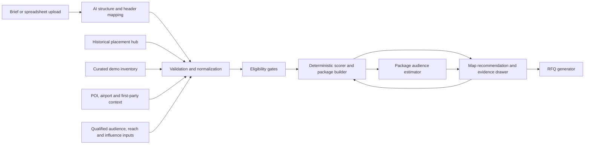

# Map-First Promotion Wizard MVP Design

**Status:** Approved design; replacement implementation plan ready
**Date:** 2026-08-03
**Primary sectors:** FMCG, Real Estate, Bank/Fintech
**Primary outcome:** A defensible, adjustable OOH recommendation that culminates in a supplier-verification RFQ draft
**Implementation plan:** [Calibrated Promotion Wizard Demo MVP Implementation Plan](../plans/2026-08-03-calibrated-promotion-wizard-demo-mvp.md)

**Historical plan:** [`2026-08-03-promotion-wizard-demo-mvp.md`](../plans/2026-08-03-promotion-wizard-demo-mvp.md)

**Normative addendum:** [Calibrated Reach and Live Enrichment Design](2026-08-03-calibrated-reach-enrichment-design.md)

**Implementation note:** The replacement plan incorporates the calibrated-reach addendum and supersedes the historical plan. Where this parent design and the addendum conflict, the addendum still controls.

## 1. Executive decision

Build a map-first planning experience that turns a short product brief into:

1. three recommended opportunity zones;
2. one recommended media package within budget;
3. a navigable explanation of why each zone and site was selected;
4. a compact, clickable estimate of target reach and influential-audience capture;
5. direct budget, zone and site adjustments; and
6. a supplier-grouped RFQ draft for rate, availability and compliance verification.

The first view stays intentionally sparse: one brief, one map, three zones and one package. The package strip adds one two-value `Audience estimate`: estimated target reach and `Influence capture`, the safe user-facing name for the requested target-audience-dominance/perception-share concept. Methodology, audience composition, overlap, source evidence, inventory detail and RFQ content appear only after a click.

The recommendation engine is deterministic and evidence-led. AI extracts and structures briefs, maps spreadsheet headers, selects an appropriate planning preset and writes explanations from approved evidence. AI does not invent inventory, availability, reach, influence propensity, rates, market-share lift or performance outcomes. `Influence capture` means the estimated share of a category-specific, influence-weighted target universe reached by the package; it does not measure actual persuasion, brand perception, word of mouth or market dominance.

## 2. Why this is the best MVP

Three product approaches were considered:

| Approach | Strength | Cost/risk | Decision |
|---|---|---|---|
| Dashboard and strategy workbench | Exposes all strategy and scoring controls | Too dense for a live demo; obscures the recommendation | Rejected |
| Map-first progressive disclosure | Creates an immediate visual answer while preserving evidence depth | Requires disciplined drawer states | **Approved** |
| Chat-first planning assistant | Familiar AI interaction | Harder to compare geography and adjust a media plan confidently | Retain only as optional brief input, not the primary UI |

The approved direction creates the highest demo value with the least build effort because the recommendation is visible immediately and every deeper element reuses one contextual drawer.

## 3. Source-hub findings

The Drive hub contains six relevant Office-format workbooks. They were inspected read-only.

### 3.1 Historical OOH sources

| Source | Canonical data area | Rows | Approximate distinct site keys | Important contents |
|---|---|---:|---:|---|
| [OOH Historical Data 2018–2023](https://docs.google.com/spreadsheets/d/1zTMMrbfM7LeYIlPs1tqENk9XmOeFUYda/edit) | `Sheet1` | 119,524 | 28,483 | Advertiser, geography, address, brand/category, board type, format, static/digital class, nominal rate, month/quarter/year |
| [OOH Industry Data, Full Year 2023](https://docs.google.com/spreadsheets/d/1Ox30GAOxvGMzZqMLAc15bRfhnRL8Bs0T/edit) | `DATA` | 40,096 | 13,416 | Same placement fields plus useful category, format, advertiser and board-type pivots |
| [OOH Industry Data, FY2024–Q1 2025](https://docs.google.com/spreadsheets/d/17S9-K74evgXkEDd8meOgiFjU98T9rSUE/edit) | `FY 24 - Q1 25` | 42,932 | 15,652 | Latest hub placement period (through Q1 2025), with the same 16-column shape |

The three canonical data areas contain 202,552 placement-month rows. The approximate site keys above are calculated within each workbook using normalized state, city, address, board type and static/digital classification; they must not be summed and treated as globally deduplicated inventory.

The history is particularly strong for the target sectors. Across the 2018–2023 source alone, category labels include 67,179 FMCG-proxy rows, 2,389 bank rows and 1,626 real-estate rows. The 2024–Q1 2025 source includes 15,418 FMCG-proxy rows, 1,356 bank rows and 1,336 real-estate rows. These counts indicate useful competitive-pattern depth, not audience reach or unique campaigns.

### 3.2 Airport sources

The `Airport Data` folder contains FAAN workbooks for 2023, 2024 and 2025. They provide monthly domestic and international passenger arrivals/departures by airport; the 2023 and 2024 files also contain aircraft, cargo and mail movements.

These records are useful for contextualizing airport opportunity and seasonality. They are not advertising impressions, unique visitors, terminal-zone footfall or audience profiles. The MVP may show them as `passenger movements` with year, month, direction, airport and FAAN provenance. Any conversion to average daily movement must disclose the calendar denominator and must not be called daily reach.

### 3.3 What the hub can and cannot support

The hub can support:

- competitive placement patterns by geography, category, brand, format and time;
- relative historical rate bands;
- observed placement-month persistence and burst patterns within the documented sources;
- category-format tendencies;
- observed placement gaps and concentration within documented source coverage; and
- analogue retrieval for similar campaign contexts.

The hub does not currently provide:

- stable structure, face or owner identifiers;
- coordinates or exposure-zone geometry;
- current availability or owner-confirmed prices;
- site photos, orientation, size, illumination or viewability inputs;
- permit and category-restriction status;
- traffic, OTS, LTS, audience, reach or deduplication methodology; or
- proof-of-posting/play and delivery status.

Therefore, historical placements must remain a separate evidence layer. They must never be silently promoted into bookable inventory.

The hub also cannot populate estimated target reach or Influence Capture: it contains neither a defined audience universe nor a qualified exposure/deduplication model or category-specific influence study. Those outputs require separate governed enrichment or the explicitly synthetic seeded demo fixture.

### 3.4 Data-quality implications

The historical sources contain repeated monthly observations, spelling/case variation and near-duplicate addresses. The latest-period hub file also contains at least two shifted/malformed rows whose values appear under the wrong columns. The import layer therefore requires explicit schema mapping, data-type checks, anomaly detection, row quarantine and field-level provenance.

The stored `MONTHLY RATE` is often derived from `ANNUAL RATE / 12`. It is a nominal rate proxy and must not automatically be described as actual media spend, net cost or paid invoice value.

## 4. Product boundary

### 4.1 Included in the demo-friendly MVP

- A short structured brief with an optional free-text AI entry point.
- Sector templates for FMCG, Real Estate and Bank/Fintech.
- Lagos as the seeded demo market, with five candidate zones and a small curated demo-inventory sample.
- Three recommended zones and one recommended package.
- One contextual drawer for zone, site, evidence, methodology and RFQ states.
- Direct budget changes, zone replacement and site swap/remove actions.
- Transparent Planning Fit scoring and separate Evidence Confidence.
- One compact audience signal on the first result: modelled target reach and influence capture, or explicit degraded/unavailable labels.
- Historical competitor/rate evidence from the hub.
- Live `.xlsx`, `.csv` or `.tsv` upload for current inventory rows. First-party service/distribution templates and eligibility geometry are deliberately deferred so the demo has one unambiguous, reviewable import path.
- Supplier-grouped RFQ drafts for supplier verification, with copy/download actions and provenance-aware export controls.
- Three pre-seeded demonstration briefs, one per target sector.

### 4.2 Explicitly excluded

- Direct booking, payment, contracting or media-owner email delivery.
- Guaranteed availability or final pricing.
- Predicted sales, leads, ROI or market share.
- Measured brand perception, share of mind, persuasion, advocacy, word-of-mouth cascade or individual-level thought-leader identification.
- A national causal-demand simulator.
- Cross-channel reach/frequency deduplication.
- User-editable scoring weights in the default experience.
- A dashboard, strategy rail, KPI grid, radar chart or visible formula ledger on first load.
- Multi-user approval workflows and complex permissions.
- Live supplier, programmatic DOOH or proof-of-play integrations.
- Side-by-side plan comparison; the MVP explains one recommended package and its alternatives progressively.

## 5. Experience contract

### 5.1 Primary states

The interface has six explicit states:

1. **Brief ready:** Sector, Product, Priority audience, `Create recommendation`, and one dominant map with no implied recommendation.
2. **Generating:** The brief remains visible while named stages such as `Checking inventory`, `Scoring zones` and `Building package` replace the action. No fabricated percentage is shown.
3. **Recommendation loaded:** The map shows a sentence such as `Focus on Yaba/Akoka, Ikeja and VI/Ikoyi`, three numbered recommended zones, muted alternatives, one package strip with asset count, owner count, indicative cost, a clickable Planning Fit/Confidence value and a compact clickable `Audience estimate`, plus a budget control, `How was this chosen?`, `Adjust sites` and `Review RFQ`.
4. **Draft changed:** The recommendation view remains intact, changed elements are marked, and a small `What changed?` action appears.
5. **Active customised:** Applying a valid draft clears the dirty state, keeps an `Original recommendation` reset path and marks the package as customised.
6. **Generation failed:** The populated brief and last valid recommendation, when one exists, remain available with a concise failure reason and retry action.

No scorecard or evidence panel is open by default in any state.

The audience strip is a second line beneath the package facts, not a KPI grid: `240k–290k est. target reach • ~63% influence capture`, followed by `Synthetic scenario • Audience evidence D`. Reach percentage and both full scenario ranges live in the drawer; `~63%` is the rounded base-scenario result or median statistical replicate, never an unstated midpoint. If neither exists, the strip shows the rounded range. Headline counts round to two significant digits/nearest thousand and percentages to whole points; evidence retains lossless canonical paired values rather than a second rounded representation. On narrow screens the line collapses to one `Audience estimate` button that opens the drawer with Reach and Influence tabs already visible. The values are deterministic demo fixtures, not Lagos market claims. Production values appear only when §7.8 is satisfied. Otherwise the same slot shows the truthful degraded state, for example `Target reach not modelled • Influence profile not configured`.

The compact brief shows only sector, product and audience. Sector templates supply visible default assumptions for objective, Lagos geography, working budget, flight duration and the seeded demo audience/influence profile. `More options` exposes objective, geography, exact budget, dates and one readable assumption such as `Influence lens: merchant, campus and professional connectors · Confirmed`, with the profile name/version beneath it. Seeded demo briefs are preconfirmed. The user may choose another reviewed profile or `No influence profile`; raw propensity weights are not edited in the default experience. An unconfirmed non-demo mapping shows `Influence profile awaiting confirmation`, never a percentage, and must be confirmed before its numbers enter the internal RFQ. A recommendation may be explored with assumed dates, but RFQ generation requires explicit date confirmation.

### 5.2 Progressive disclosure

All depth uses one drawer so the map remains visible.

| Trigger | Drawer state | Required content |
|---|---|---|
| Click recommended zone | Zone detail | Rank, one-sentence rationale, three evidence reasons, two or more suggested inventory faces, `Exclude zone`, `View evidence` |
| Click alternative zone | Alternative detail | Trade-off, supporting evidence, candidate sites, `Use this zone` |
| Click or choose a site | Site detail | Face ID, owner, format, location, provenance/as-of dates, indicative rate, availability/permit state, role in plan, `Swap` or `Remove` |
| Click `View evidence` | Evidence trail | Input value, metric basis, period, source, transformation, confidence and limitations |
| Click Planning Fit or `How was this chosen?` | Method | Formula, preset/version, five pillar weights, Planning Fit, Evidence Confidence and interpretation |
| Click a method pillar | Pillar contribution | Effective contribution, compatible metric mode, relevant zones and any unscored component |
| Click the audience-strip label/background | Audience summary | Target definition, universe, reach count/rate/range, influence capture range, period, basis, audience evidence and limitations |
| Click the reach value | Reach detail | Package-level deduplication method, exposure threshold, overlap scope, uncertainty and marginal reach lost if each zone is removed |
| Click the influence value | Influence detail | Category-specific influence construct, aggregate archetype/cell weights and capture, highest/lowest modelled-coverage archetype, model version, source and limitations |
| Click `Review RFQ` | RFQ review | Campaign summary, zones, selected faces, internal-only working budget by default and supplier confirmation requests |

The drawer has Back, Close and breadcrumb behavior. Escape closes it. Hover may cross-highlight map and list items, but every action is available by click and keyboard.

The exact five-click confidence path starts from the package strip and stays inside this drawer: `Planning Fit (1) → pillar (2) → zone (3) → site (4) → evidence/source record (5)`. Each level shows only the evidence relevant to the clicked item, and the final record exposes source owner, period, transformation, quality flags and source link or snapshot. `How was this chosen?` opens the same Method state. Breadcrumbs allow users to move back without losing the map selection.

### 5.3 Adjustments

The MVP supports only the adjustments that visibly improve the plan without becoming a planning workbench:

- change working budget;
- exclude one recommended zone and promote the best eligible alternative;
- choose an alternative zone to replace the lowest-ranked selected zone;
- swap or remove a site, except that `Remove` is disabled when it would leave a selected zone without a face; that state offers `Swap` or `Exclude zone`; and
- reset to the original recommendation.

Every adjustment creates a dirty draft from the current active package. The map, recommendation sentence, package count/cost, audience estimate and RFQ preview update together. `What changed?` shows both current-active → dirty-draft deltas and cumulative original → dirty-draft deltas for Planning Fit, Evidence Confidence, cost, selected zones/faces, comparable target reach/influence-capture estimates and only the pillar contributions affected by the action. It states the causal action and planning trade-off, for example `Broader modelled reach; lower merchant-peer-adviser coverage`, rather than implying predicted campaign impact. Numeric audience deltas appear only when baseline and draft use the same target definition/universe, geography, period/daypart, exposure basis/threshold, reach-method version and influence-profile version, with both exposure-plan fingerprints recomputed by that compatible model. Budget/zone/site/face-schedule or share-of-time actions either recompute on that frozen basis or show the draft audience estimate as unavailable; they never create a new basis. Only an explicit, confirmed target, geography, flight-date or influence-profile edit creates a new baseline, labeled `Not comparable` to the prior baseline. Range comparisons show each full range side by side and never subtract unrelated interval endpoints.

The drawer offers `Undo last change`, `Apply draft` and `Reset to original`. Applying clears the dirty draft, creates the `Active customised` state and makes that package the RFQ basis; the immutable original remains the cumulative comparison/reset target. Subsequent edits start from the active customised package. Invalid drafts retain the last valid scores and package, identify the blocking field or gate, and disable RFQ progression.

When a valid package change cannot be recomputed by the audience model, the draft remains applicable because the lens is diagnostic, but the confirmation states `Audience estimate will become unavailable and will be recorded as unavailable in the internal RFQ` and requires acknowledgment before `Apply draft`.

While a valid dirty draft exists, the primary RFQ action is labeled `Apply & review RFQ`. It atomically applies that draft and then opens RFQ review using only the active customised package. If validation fails, nothing is applied and the dirty draft remains available for correction.

### 5.4 Live upload

`Upload spreadsheet` is available beside the brief and from the adjustment drawer. The executable MVP accepts one template: **Inventory** — current sites/faces, owners, coordinates or addresses, formats, rates and availability. This narrower choice is intentional: it proves live spreadsheet mapping, local validation, optional geocoding, context-only planning, and RFQ provenance without introducing an unrelated catchment-policy editor.

Import flow:

1. Choose `.xlsx`, `.csv` or `.tsv`.
2. Select the data sheet when an `.xlsx` contains more than one plausible table.
3. Auto-map headers to the canonical schema.
4. Show the required location mapping separately from recommended/mapped, ignored and invalid fields, plus a ten-row preview.
5. Quarantine invalid rows; never silently drop or coerce them.
6. Record a local declaration over the exact selected rows; this action transmits no row data.
7. Optionally save customer coordinate corrections with separate, row-scoped supplier-RFQ export permission and optionally authorize address-only live geocoding.
8. Show the new map layer and recalculate affected recommendations as a reversible dirty draft.

Header mappings below 80% model confidence require explicit user confirmation. An MVP context row requires only coordinates or a usable address. Asset ID is recommended; when absent, the importer generates a stable sheet-and-row label and records a warning. Owner/seller, format/class, rate/currency/basis, availability, source artifact and `rate_as_of` remain recommended supplier-verification fields: missing values stay explicit and cannot become calibrated inventory or an unconditional booking line. A missing permit or fresh-photo field is likewise conditional/unknown.

Service/distribution imports are post-MVP. A later guided template will require a source location ID, type, coordinates or address, status, weight and source artifact/dataset. Any future eligibility mode will require a supplied polygon or an explicit `service_radius_m` value shown at confirmation; it will never invent or silently buffer a point.

Before confirmation, the uploader records data purpose, rights to use and the §8.4 privacy classification in a versioned declaration scoped to all selected rows. That declaration is independent of network consent. Only address-bearing rows can enter the separately disclosed app-server preflight and provider scopes; coordinate-only uploads can be declared, corrected, and authorized for supplier-RFQ export without either network consent. File, sheet, mapping or selection changes invalidate the declaration and its derived authorizations. Withdrawing app-server consent preserves a still-valid local declaration and row-scoped export permission. Confirming an upload after a recommendation exists creates a reversible dirty draft rather than silently replacing the baseline. `What changed?` names the dataset revision, affected rows, service geometry/rule and the gates or score inputs that changed.

The demo upload moment is a current-inventory file: accepted rows appear as a clearly labelled context-only layer, optional address geocoding is separately authorized and reviewed, and applying the selected rows creates a reversible context-shortlist draft. Supplier RFQs retain a coordinate only when it is a separately saved customer correction with an exact, current declaration-bound row authorization; uploaded coordinates and provider-derived candidates remain internal context and become `Confirmation requested` in supplier output. The upload never silently changes calibrated delivery or invents a service catchment.

The simple MVP does not expose a third generic `audience score` upload. Target universes, influence profiles and reach-model runs enter through seeded fixtures or a governed provider/admin import because a standalone demographic or reach-percentage column cannot establish a denominator, qualified exposure or package deduplication. A later guided audience import may expose the §8.1 structures only after schema, rights, privacy, effective-sample, uncertainty, model-version and compatibility validation. It rejects/quarantines a reach percentage without its universe and deduplication metadata, unique reach above universe, overlapping cells presented as mutually exclusive, demographic-only `thought leader` values, missing model/uncertainty fields and sensitive or under-threshold cells.

## 6. Sector templates

The sector template supplies terminology, context signals, regulated-category checks and default weights. A user-selected campaign objective overrides sector weights.

| Sector | Default objective | High-value first-party input | Contextual enrichment | Important guardrail |
|---|---|---|---|---|
| FMCG | Launch / availability | Stocked outlets, weighted distribution, stock status | Supermarkets, markets, campuses, commuter and leisure contexts | Media cannot compensate for unavailable product |
| Real Estate | Consideration / enquiries | Project coordinates, price band, property type, target buyer catchment | Workplaces, affluent residential areas, airports, premium retail and feeder corridors | Do not describe enquiries or sales as predicted without response data |
| Bank/Fintech | Trust / adoption | Serviceable geographies, branch/ATM/agent/merchant footprint, eligibility rules | Workplaces, campuses, commerce, transport hubs and finance contexts | Booking remains conditional on product and creative compliance |

Each sector also has a versioned, human-reviewed influence-archetype catalog used only when a qualified influence profile is available. Instrument-supported labels may include category recommenders, retail/household purchase advisers, property/finance advisers, merchant peer advisers and professional peer advisers. Otherwise the UI uses neutral context labels such as `Campus-linked target`. These labels describe aggregate, category-specific reporting strata, not named people. User confirmation selects among already source-qualified constructs; it cannot create `q_g`, improve evidence quality or validate a demographic stereotype. Changing the construct creates a new non-comparable baseline. Demographics may project a validated propensity into aggregate cells, but age, income, occupation, location or a stereotype alone never establishes that a person is a thought leader.

## 7. Recommendation method

### 7.1 Sequence

1. Normalize the brief and source data.
2. Apply preliminary non-confidence, non-budget gates.
3. Stabilize and freeze the normalization cohort, D/E modes and Evidence Confidence.
4. Apply the campaign-budget gate; compute face features/scores.
5. Rank faces inside each zone and retain up to four deterministic candidates.
6. Compute candidate-zone reducers and score zones for the stated objective.
7. Build candidate packages within budget.
8. Recompute Planning Fit at package level.
9. Return the best-fit package, two package alternatives internally and up to three selected zones visually.
10. Generate explanation facts from the deterministic result.
11. Allow AI to express only those facts in plain language.

Site scores may help rank inventory within a zone, but they are never added together and presented as campaign performance. Package-level Planning Fit is recomputed because catchment coverage, contextual mix and competitive alignment change with each selection. Supplier/format concentration is disclosed as a package trade-off but is not silently added to a pillar. Audience coverage or overlap is shown only when a qualified package-level reach model supplies its basis, deduplication and uncertainty. Per-face or per-zone reach is never summed to manufacture package reach.

### 7.2 Planning Fit

`Planning Fit = Σ (pillar score × objective weight)`

All pillar scores are 0–100. Weights sum to 100%.

The pillars operationalize the standard objective-led planning sequence: define the target and job to be done, qualify available delivery, test context and timing, construct a complementary portfolio, then assess economics. Industry measurement standards govern the inputs and claim labels; the combined score and weights remain a transparent product-defined decision aid, not a certified industry rating or outcome probability.

| Pillar | MVP interpretation |
|---|---|
| Strategic alignment (A) | Target match plus objective/format match |
| Audience suitability/delivery (D) | One explicit, homogeneous delivery mode for the whole ranked cohort |
| Context and timing (C) | Purchase/service context, catchment fit and requested time coverage |
| Portfolio and competition (P) | Geographic gap closure plus chosen whitespace/conquest logic |
| Economics (E) | Basis-labeled CPM when genuinely compatible exposure exists; otherwise a period-compatible rate position |

All five top-level pillars are required for a numeric Planning Fit. If any pillar cannot be supported, the interface shows `Planning Fit: insufficient evidence` and does not silently inflate the other pillars by renormalizing them. An optional subcomponent inside a valid pillar may be omitted only when the method definition permits it; its effective weights and omission are then shown. A fabricated zero or neutral value is never substituted.

Suggested component formulas:

- `A = 0.60 × TargetMatch + 0.40 × ObjectiveMatch`
- `C = 0.70 × ZoneContextFit + 0.30 × TimingFit`
- `P = 0.70 × GapClosure + 0.30 × CompetitionAlignment`

Numeric cohort values use `PR(x) = 100 × (midrank(x) − 1) / (N − 1)`; when `N = 1`, `PR(x) = 50`. Lower-is-better measures use `100 − PR(x)`.

At baseline generation, the engine persists a `normalization_cohort_id`, dataset revision, final member IDs, filters and stabilization trace for the brief's sector, geography and dates. Percentiles never use only the currently visible/selected items. Budget, zone and site drafts reuse the frozen cohort/modes even when selections are removed; a confirmed upload runs stabilization again and creates a draft with a new named cohort revision, which `What changed?` discloses. Changing sector, geography or dates generates a new baseline.

D-mode selection is deterministic: the method takes the first mode for which every ranked cohort member has a compatible valid input in the fixed order `D_Audience → D_LTS → D_OTS → D_ContextProxy`. The chosen mode and input definition are frozen on the cohort. If no common mode exists, D and Planning Fit are not scored.

E-mode selection is also frozen for the run. Use `E_CPM` only when every cohort face has compatible cost and impression inputs for the chosen D basis plus a valid format-specific cohort. Otherwise use `E_RatePosition` only when every cohort face has compatible rate inputs and a valid format-specific rate cohort. If neither condition holds, E and Planning Fit are not scored. A package never mixes CPM-backed and rate-position-backed face scores.

`TargetMatch`, `ObjectiveMatch` and the separate `ContextTargetFit` catalog use documented mappings of strong/high `100`, moderate/medium `60` and weak/low `20`. A tag without a source record is not scoreable.

For face `i` in zone `z`, `A_i = 0.60 × TargetMatch_z + 0.40 × ObjectiveMatch_i`. The brief/template supplies context tags `k` and positive importance weights `w_k` that sum to 1; `ZoneContextFit_z = Σ(w_k × ContextMatch_zk)`, using the documented 100/60/20 catalog. Every weighted tag needs an evidence record or C is not scored.

Timing uses the requested date × daypart planning units. `AvailabilityCoverage_i = 100 × available_requested_units_i / requested_units`. If a source-backed season/event/daypart match exists, `TimingFit_i = 0.70 × AvailabilityCoverage_i + 0.30 × SeasonalAlignment_i`, where Seasonal Alignment uses 100/60/20. Otherwise `TimingFit_i = AvailabilityCoverage_i` with effective weights 100%/0%. `C_i = 0.70 × ZoneContextFit_z + 0.30 × TimingFit_i`.

For A and C reducers, a qualified OTS/LTS/Audience mode uses compatible basis-impression shares within each zone and then across zones. `D_ContextProxy` uses equal face weights inside each zone and equal selected-zone weights, preventing face count from manufacturing fit. Zone scores use the retained `R_z` faces defined in §7.6; package scores use only selected faces. These exact reducer weights are stored with the result.

The D pillar is versioned and visibly labeled as exactly one of:

- `D_OTS`: delivery from qualified opportunity-to-see estimates;
- `D_LTS`: delivery from qualified likelihood-to-see estimates;
- `D_Audience`: delivery from a qualified audience estimate; or
- `D_ContextProxy`: source-backed contextual target fit when no qualified delivery estimate exists.

`DeliveryScore` is `PR(compatible target exposure)` within the frozen normalization cohort, or `100 × min(qualified reach / reach_goal, 1)` when a validated unique-reach method and explicit goal exist. `D_mode` is the enum above; the numeric output is `D_score`. The §7.8 visual lens is not a sixth pillar. In the MVP, Estimated Target Reach is `D_input` only when the Broad reach objective uses that same qualified value to drive `D_Audience`; otherwise it is `display_only`. For the explicit Influential core objective, influence-weighted reached mass replaces broad reach as the one D input, while the displayed Influence Capture percentage is a denominator-normalized explanation of that same delivery quantity. Re-displaying either value adds no second contribution, and the audience primitives do not also enter A. Broad reach and influence-weighted reach are never added together.

`FrequencyFit` is allowed only when the same validated unique-audience method supplies package average frequency `f` and the user supplies `0 < f_min ≤ f_max` for the same target, universe, geography and period:

- `100` when `f_min ≤ f ≤ f_max`;
- `100 × f / f_min` when `f < f_min`; and
- `100 × f_max / f` when `f > f_max`.

With that input, `D_score = 0.70 × DeliveryScore + 0.30 × FrequencyFit`. Otherwise `D_score = DeliveryScore`, the effective weights are shown as 100%/0%, and the product never assumes a universal `3+` rule. `D_ContextProxy` uses a source-backed `ContextTargetFit` catalog that is distinct from A's target/objective mappings, is labeled `context proxy` everywhere, and caps Evidence Confidence at grade C.

Every candidate in one ranking run must use the same D mode, metric definition, population unit, target/universe, period/daypart, geography and normalization cohort. The engine never ranks an OTS-backed candidate against a contextual proxy under the same 0–100 D score. If a homogeneous cohort cannot be formed, D and therefore Planning Fit are not scored.

`GapClosure = 100 × Σ(weight_c × covered_c) / Σ(weight_c)` over versioned priority catchment cells, where `covered_c` is 1 only when at least one selected face's explicit `planning_coverage_geometry` covers cell `c`. That geometry is a reviewed zone polygon or an uploaded polygon/disclosed buffer; a face point never creates coverage by itself. The drawer names the numerator, denominator, geometry, source and date. Without a validated priority layer, configured opportunity zones receive equal weight, the result is labeled `geographic proxy`, and Confidence is capped at C.

`CompetitorIntensity_z = relevant placement-month rows in zone z / documented source-covered months` for one frozen category/competitor definition and lookback window. Its PR cohort is the frozen eligible-zone set; missing zone coverage makes the component unscored. Under whitespace, zone alignment is `100 − PR(CompetitorIntensity_z)`; under conquest it is `PR(CompetitorIntensity_z)`. `CompetitionAlignment_package` is the equal-weight mean of selected-zone alignment scores, so adding faces inside a zone cannot change it. Then `P = 0.70 × GapClosure + 0.30 × CompetitionAlignment_package`. Under a neutral strategy, `P = GapClosure` with effective P subweights shown as 100%/0%. Observed placement counts are called competitive activity, not share of voice.

When the denominator is compatible, `BasisCPM_i = 1,000 × Cost_i / BasisImpressions_i` and `E_i = 100 − PR(BasisCPM_i)` within face `i`'s compatible format cohort. The interface names the denominator explicitly—for example `OTS CPM`, `LTS CPM` or `Audience CPM`—and never displays generic `Target CPM`.

CPM compatibility requires the same metric definition and basis, person/proxy unit, target and universe, period/daypart, geography, model/source quality, currency, gross/net price status, included taxes/production and price vintage. In frozen `E_RatePosition` mode, `E_i = 100 − PR(Rate_i)` only within a compatible city, format, rate period and rate-basis cohort. In either mode, `E_package = Σ((Cost_i / TotalCost) × E_i)`, so mixed-format packages are comparable only after each face is normalized inside its own compatible format cohort. If any selected face lacks the frozen mode/cohort, E and Planning Fit are not scored. Owner-confirmed, time-aligned offers may be labeled `relative rate efficiency`; unnormalized hub rates are labeled `historical nominal rate position` and never imply a current buying price.

### 7.3 Presets

Sector defaults:

| Preset | A | D | C | P | E |
|---|---:|---:|---:|---:|---:|
| FMCG launch / availability | 20% | 35% | 20% | 15% | 10% |
| Real-estate consideration | 30% | 15% | 30% | 15% | 10% |
| Bank/fintech trust / adoption | 30% | 25% | 20% | 15% | 10% |

Objective overrides:

| Objective | A | D | C | P | E |
|---|---:|---:|---:|---:|---:|
| Awareness / launch | 20% | 35% | 15% | 20% | 10% |
| Consideration / trust | 30% | 20% | 25% | 15% | 10% |
| Action / leads | 25% | 15% | 35% | 10% | 15% |

These are `OOH DataHub planning presets`, not an industry standard or certification. The default UI does not expose weight editing.

### 7.4 Eligibility gates

The preliminary set `S0` excludes a face when any non-confidence gate fails:

- inactive or unavailable for the campaign dates;
- outside selected geography or a required service/distribution catchment;
- missing/non-positive price;
- missing face ID, coordinates, owner, format or rate basis;
- a known physical-site permit failure, brand-safety failure or sector restriction.

Confidence and mode selection then use a deterministic shrinking fixed point:

1. On current set `S_t`, select common D and E modes using the fixed orders and schema/qualification rules, without using the Q threshold.
2. If no common modes exist, stop with `Planning Fit: insufficient evidence`.
3. Compute all essential feature and face-scope Q inputs needed for cohort eligibility under those modes; zone/package Q is computed later from frozen members.
4. Set `S_(t+1)` to members of `S_t` with Q ≥ 40 and no missing essential numeric/gating input.
5. If membership and modes are unchanged, freeze the cohort and compute final percentiles; otherwise repeat from step 1.

Faces are never added during stabilization, so the process terminates after at most `|S0|` removals. The stored trace lists each removal reason and any mode change. After freezing, a face priced above the total campaign budget is ineligible for the current package but remains in the normalization cohort, so a budget adjustment cannot renormalize every score. Remaining-budget checks occur only during package validation or after the user locks selections.

An unknown or pending physical-site permit may be explored only as conditional inventory and is never called verified or bookable. A known site-permit rejection is a hard failure. Creative approval is tracked separately: an RFQ may be prepared while approval is pending, but a media-order or exposure/delivery status is blocked until the exact creative version has the required ARCON ASP Certificate of Approval and any prerequisite sector-regulator approvals.

### 7.5 Evidence Confidence

Confidence is separate from Planning Fit and never multiplied into it.

Each `method_version` includes a `quality_rule_registry` entry per feature: `required_field_ids`, a deterministic `required_subject_query`, `essential_for` (`gate | score | cost`), freshness SLA, expected granularity, allowed validation states and provenance caps. Cohort creation resolves and snapshots the required subject UUIDs. `CoveragePct` always uses that frozen set, not the rows that happen to be populated. The plan persists `essential_feature_ids`; optional evidence that affects no gate, score or cost is excluded from Q.

MVP feature requirements are:

| Feature | Required fields | Required subjects | Default temporal rule |
|---|---|---|---|
| Identity/eligibility | namespaced ID, owner, coordinates/accuracy, format/class, operating status, source/effective time | every normalization-cohort face | identity/status reviewed within 365 days |
| Price/E | currency, amount, gross/net state, rate basis, inclusions/taxes, `rate_as_of`, format cohort | every cohort face for E-mode selection; every selected face for package cost | 30 days for an unconditional current label; exact source period for historical position |
| Availability/timing | status, window, as-of time and requested date × daypart units | every selected face and every face used in candidate-zone timing | owner-confirmed within 7 days for an unconditional label |
| A/C context | catalog/version, subject/tag, match level, importance weight, source and effective period | every weighted tag for every ranked zone | catalog/source reviewed within 365 days |
| D delivery | all mode-specific §8.2 qualification, universe, period, unit, method and uncertainty fields | every face/zone in the frozen D cohort | effective within 365 days or validated seasonal match |
| P coverage/competition | geometry/version/source, priority-cell weights; category/competitor definition, placement rows, covered months and lookback | all priority cells and every eligible-zone cohort member | geometry within 730 days; competition exact lookback, and within 365 days when labeled current context |

Site permit, photo and creative-approval freshness follow §8.4 and affect conditions/RFQ readiness; they enter Q only when a method version explicitly uses them in a hard gate or numeric feature.

`Q = 0.25 × SourceFitness + 0.25 × Validation + 0.20 × TemporalAlignment + 0.20 × GranularityCoverage + 0.10 × Completeness`

Each component uses this versioned 0–100 lookup:

| Component | Deterministic score |
|---|---|
| `SourceFitness` | 100 claim-specific authoritative/contracted source with immutable artifact; 75 first-party/provider source fit for the claim; 50 disclosed modeled/secondary source; 25 analogue, inferred or demo source; 0 unknown/incompatible |
| `Validation` | 100 independent audit or observed ground-truth check; 75 independent reconciliation/calibration with disclosed test; 50 provider QA with method; 25 schema/range checks only; 0 none |
| `TemporalAlignment` | 100 meets the field SLA and campaign/season period; 75 no more than 2× the SLA or validated seasonal match; 50 no more than 4×; 25 older/misaligned but dated; 0 no usable period |
| `GranularityCoverage` | `0.60 × G + 0.40 × CoveragePct`, where G is 100 for face/daypart, 75 for face/period or zone/daypart, 50 for zone/period, 25 for market-level and 0 incompatible; `CoveragePct = 100 × valid required subjects / required subjects` |
| `Completeness` | `100 × valid populated required fields / required fields`; a required uncertainty/method field counts as missing |

`metric_basis` is reported separately and never earns confidence merely for sounding more sophisticated.

For each scored feature, Q uses the weakest directly contributing evidence record. Pillar Q is the effective-subcomponent-weighted mean of its feature Q values. `Q_raw` is the objective-weighted mean of the five pillar Q values; `Q_min` is the minimum essential feature Q used for an eligibility gate, score or cost. At face, zone or package scope, `Q_final = min(Q_raw, Q_min + 15, applicable provenance/method caps)`. This prevents a critical weak source from being averaged away while remaining reproducible.

Caps are mandatory: no independent validation caps Q at 84; supplier self-attestation alone cannot exceed 84; `D_ContextProxy` caps it at 69; any demo/synthetic input essential to the result caps it at 54. A missing source, period or method on an essential numeric/gating input makes the result unranked rather than assigning a neutral score; explicitly permitted conditional fields such as an unknown site permit remain conditions, not fabricated inputs.

| Grade | Score | Meaning |
|---|---:|---|
| A | 85–100 | Time-aligned, granular evidence with independent audit/validation or independently observed ground truth |
| B | 70–84 | Time-aligned provider-confirmed evidence with disclosed method and validation; supplier attestation alone cannot exceed B |
| C | 55–69 | Area-level or modeled data with assumptions and uncertainty disclosed |
| D | 40–54 | Stale, inferred, synthetic/demo or materially incomplete |
| Unranked | Below 40 | Insufficient evidence for a scored recommendation |

Every explanation shows Planning Fit, Confidence, preset/version, D mode, normalization cohort, strongest reasons, main trade-off, measurement basis, source period and assumptions.

### 7.6 Deterministic face and zone ranking

For each eligible face `i`, `GapPotential_i` uses the same priority-cell equation as Gap Closure but only that face's explicit planning geometry. `P_i = 0.70 × GapPotential_i + 0.30 × CompetitionAlignment_z`, or `P_i = GapPotential_i` in neutral mode. `FaceFit_i` applies the active five-pillar preset to `A_i`, `D_score_i`, `C_i`, `P_i` and `E_i`.

Within each zone, scored faces sort by `FaceFit_i` descending, `Q_i` descending, price ascending and face UUID ascending. The first four are the retained face set `R_z`. An eligible but unscored face remains inspectable as conditional inventory but cannot displace a scored face; if no complete scored set can form a package, the result is `Planning Fit: insufficient evidence`.

Candidate-zone reducers use `R_z`:

- `A_z` and `C_z` use the reducer weights defined in §7.2;
- in OTS/LTS/Audience mode, `D_z = Σ(BasisImpressions_i / Σ BasisImpressions_Rz × D_score_i)`; in context-proxy mode, `D_z = ContextTargetFit_z`;
- `E_z = Σ(Cost_i / Σ Cost_Rz × E_i)`;
- `GapPotential_z` applies the priority-cell equation to the union of `R_z` planning geometries; and
- `P_z = 0.70 × GapPotential_z + 0.30 × CompetitionAlignment_z`, or `P_z = GapPotential_z` in neutral mode.

`ZoneFit_z` applies the active five-pillar preset to A_z, D_z, C_z, P_z and E_z. Zones sort by Zone Fit descending, zone Q descending, minimum retained-face price ascending and stable zone ID ascending. The selected package's zones appear as recommendations in this order; non-selected zones appear as alternatives in zone-rank order.

### 7.7 Deterministic demo package builder

The MVP uses five versioned, human-reviewed Lagos planning polygons; AI does not invent or redraw zones. Face membership is determined by point-in-polygon after geocoding validation.

For the small demo inventory, the builder uses the retained face sets from §7.6, enumerates valid three-zone packages of three to eight faces with at least one face per selected zone, and rejects any package above budget or failing a hard gate. If fewer than three zones are eligible, it uses the truthful eligible count. These limits are method-version parameters, not universal media-planning rules.

Package features are recalculated rather than summed from site scores. A and C use exposure-weighted face/zone inputs when one compatible delivery basis exists, otherwise equal zone weights are disclosed in context-proxy mode. For OTS/LTS/Audience modes, D is the basis-impression-weighted mean of face D scores unless a validated package unique-reach/frequency model permits direct recomputation; `D_ContextProxy` uses equal selected-zone weights so adding more faces cannot manufacture target fit. E uses the cost-share-weighted cohort-normalized formula in §7.2. P recalculates gap closure and competitive alignment for the complete package. Supplier/format concentration remains a visible trade-off, not an unlisted score term.

Exact package reach may enter D only when the same compatible model/version can compute every eligible candidate package before winner selection. A winner-only or post-selection reach run is `display_only`; D retains the frozen homogeneous mode used across the candidate set. The replay trace records which candidate-package reach values entered ranking.

For each package, `canonical_face_tuple = join(sort(face_uuid ascending), "|")`. Valid packages sort by Planning Fit descending, Evidence Confidence descending, cost ascending and `canonical_face_tuple` ascending as the final tie-break. The winner is shown; the next two remain internal candidates for replacements. The MVP does not expose a side-by-side comparison screen.

### 7.8 Audience estimate and influence capture

The first-output `Audience estimate` answers two questions without adding another scorecard:

1. **Estimated target reach (1+):** what share and count of the defined target universe is modelled to receive at least one qualified exposure from the exact package during the stated campaign period?
2. **Influence capture:** what share of the target's category-specific, influence-weighted audience opportunity is modelled to receive at least one qualified exposure?

`Influence capture` is the user-facing implementation of the requested `target audience dominance perception share`. The requested phrase remains an internal discovery alias only because the estimate does not measure brand perception or dominance. Its tooltip reads: `Estimated share of the target's influence-weighted audience opportunity reached by this package. It does not measure persuasion, brand perception or market dominance.`

For mutually exclusive target-audience cells `g`:

- `N_g` is the positive, source-backed target-universe count in cell `g`;
- `r_g(P)` is the deduplicated probability that a person in `g` receives at least one qualifying OOH exposure from exact package `P` during the campaign period;
- `q_g` is the calibrated 0–1 prevalence/probability that a person in `g` meets one predeclared, versioned and category-specific influence classification; and
- `r_g^I(P)` is the deduplicated probability of that exposure conditional on meeting the influence classification within `g`.

The `q_g` model stores its instrument, language/local validation, classification threshold or calibrated probability rule, weighting, base prevalence, reliability, out-of-sample validation and version. Self-report scale values, peer nominations, key-informant scores or behavioural centrality are not probabilities by themselves and cannot populate `q_g` until calibrated. If a qualified continuous weighting construct is intentionally retained, the product labels the output `Opinion-leadership-weighted coverage`, not Influence Capture or share of leaders.

The derived values are:

```text
EstimatedTargetReachCount(P) = Σ(N_g × r_g(P))
EstimatedTargetReachPct(P) = 100 × Σ(N_g × r_g(P)) / ΣN_g

InfluenceWeightedUniverse = Σ(N_g × q_g)
InfluenceCapturePct(P) = 100 × Σ(N_g × q_g × r_g^I(P)) / Σ(N_g × q_g)
```

If only general `r_g(P)` is available, using it in place of `r_g^I(P)` requires `exposure_leadership_independence_assumption = true`, labels the result `projected`, caps Audience Evidence at C and runs a stated sensitivity case. The service never silently assumes that opinion leaders travel, dwell or encounter media like everyone else.

The denominator must be positive. `reach_status` and `influence_status` are evaluated separately, so a missing `q_g` does not suppress otherwise qualified Target Reach. If any value required for one metric is missing, that percentage is unavailable unless formal whole-universe bounds are calculated; the UI reports coverage separately, for example `Influence estimate unavailable — profile covers 76% of target universe`. Complete cells are never renormalized to hide missing coverage. Statistical ranges use paired survey/reach bootstrap or provider replicates that preserve covariance and report stated quantiles. Otherwise the service recomputes the full ratio for coherent named joint-scenario bundles and displays the minimum/maximum result as a `scenario range`; it never combines independent cell extrema. When reach and influence come from separate sources, the dependence assumption and a correlation-sensitivity case are disclosed.

Each cell maps to one primary reporting archetype `a(g)`. `ArchetypeCapturePct_a(P) = 100 × Σ_{g:a(g)=a}(N_g × q_g × r_g^I(P)) / Σ_{g:a(g)=a}(N_g × q_g)`. Overlapping archetypes are rejected unless a qualified membership-deduplication model exists. Archetypes are reporting strata inside the measured construct; a human or AI label is not evidence of influence.

Opinion leadership is domain-specific. Demographics may be used to project a measured influence propensity into privacy-safe aggregate cells, but demographics alone cannot create `q_g`, classify a person as a thought leader or support a capture percentage. A demographic/context-only configuration may reuse the existing frozen-cohort `D_ContextProxy` as `Audience context fit 72/100 (context proxy)` plus `Influence profile not configured`; when that mode is not available it shows only the latter. It may not emit any thought-leader/influence metric or use reach, capture, dominance or perception language. The seeded synthetic fixture is the sole MVP exception for demonstration: it contains an explicit synthetic target universe, overlap model and calibrated influence classification, shows a scenario range, is labeled `Synthetic scenario • Audience evidence D` and can generate only watermarked RFQs.

Evidence states are deterministic:

| Available evidence | First-output treatment |
|---|---|
| Qualified package-level unique target reach plus compatible influence-specific cell reach or a provider joint result | `240k–290k est. target reach • ~63% influence capture`, with named exposure basis and Audience evidence A/B/C; full rates/ranges are in the drawer |
| Qualified total target reach plus influence profile, but no compatible influence-specific cell/joint reach | Target reach range plus `Influence estimate unavailable — joint reach not supplied` and the claim-specific Reach evidence grade |
| Qualified package-level unique target reach, no qualified influence profile | Target reach range plus `Influence profile not configured` and the claim-specific Reach evidence grade |
| Gross OTS/LTS opportunities or proxy units without qualified person conversion/package deduplication | Retain the named native basis, for example `Gross target OTS opportunities • Unique person reach unavailable` |
| Demographic/context evidence only | `Audience context fit 72/100 (context proxy) • Influence profile not configured` only when the frozen `D_ContextProxy` exists; otherwise just the latter |
| Influence profile or model has incomplete coverage | `Influence estimate unavailable — profile covers 76% of target universe` unless valid whole-universe bounds exist |
| Changed exposure plan is not supported | `Prior audience estimate no longer applies to changed faces/schedule` |
| A metric's sample/privacy guardrail fails | `<Reach or Influence> estimate withheld — sample/privacy threshold`; an unaffected qualified metric remains visible with its own grade |
| Synthetic seeded demo model | Headline reach range and approximate influence value plus `Synthetic scenario • Audience evidence D`; full scenario ranges are in the drawer |
| No compatible evidence | `Audience estimate unavailable • Add qualified audience data` |

```text
ReachEvidence = min(UniverseQuality, ReachQuality,
                    ReachCompatibilityQuality, ReachUncertaintyQuality)

InfluenceEvidence = min(UniverseQuality, InfluenceConstructQuality,
                        InfluenceConditionalReachQuality,
                        JointLinkageOrIndependenceQuality,
                        InfluenceCompatibilityQuality,
                        InfluenceUncertaintyQuality)

CompactAudienceEvidence = min(evidence grades of numeric metrics displayed)
```

Each component reuses the deterministic §7.5 quality lookups, but each claim grade is the weakest link rather than a weighted average. Influence Evidence A additionally requires validated joint influence/reach estimation or an empirically validated linkage. B permits validated reach plus a representative, calibrated category panel with documented linkage. C permits a disclosed model/projection with material assumptions, sensitivity and uncertainty, including the explicit conditional-independence fallback; it never promotes a demographics-only proxy to capture. Statistical intervals describe estimate uncertainty, claim-specific Audience Evidence describes each metric's source/method fitness, and package Evidence Confidence describes the recommendation inputs. They remain visibly separate. If both numeric metrics appear, the strip uses the weaker compact grade; audited Reach A plus Influence Capture C displays `Audience evidence C` while the drawer retains Reach A. If influence is unavailable, the strip retains `Reach evidence A/B/C/D` beside the unavailable label. A display-only audience grade never lowers Planning Fit confidence.

A claim-specific Q below 40, or any essential audience-quality component equal to zero, makes that metric unavailable; grade D covers only 40–54. An unavailable or unranked method never produces a headline number.

The compact sublabel always names the exposure basis without requiring a methodology click: `Audience basis`, `LTS-based unique reach`, `OTS-based unique opportunity` or `Synthetic scenario`, followed by the Audience Evidence badge. Bare `target reach` is not shown for an alternate OTS/LTS basis.

The default map retains recommendation-rank styling. Clicking the reach value opens Reach detail and activates Reach; clicking the influence value opens Influence detail and activates Influence. Clicking the strip label/background opens Audience Summary and retains rank styling until a metric is selected. The collapsed mobile button opens the drawer with Reach and Influence tabs immediately available. When selected, the temporary `Reach | Influence` map lens behaves as follows:

- `Reach` sizes each selected-zone proportional symbol by `marginal unique target reach lost if this zone is removed`, calculated by an exact leave-one-zone-out recomputation under the frozen plan model.
- `Influence` colors that symbol by the marginal influence-weighted reached mass lost in the same exact leave-one-zone-out recomputation. Choosing an aggregate archetype filters the contribution and cross-highlights the supporting faces.
- One short influence/archetype tag appears on a selected zone only when the construct label is instrument-supported and valid zone-level influence reach or exact marginal contribution exists; alternatives receive such tags only inside the Influence lens. Otherwise the zone has no influence tag or uses a clearly neutral context tag such as `Campus-linked target`. No tag labels an individual.

Marginal values are diagnostics and are not presented as additive shares because zones overlap. A site receives a marginal value only after an exact leave-one-face-out recomputation; otherwise its drilldown exposes model inputs and evidence without attributed reach. The legend states `Symbol size indicates modelled marginal contribution, not geographic coverage`. The drawer pairs every symbol encoding with a numerical ranked list for keyboard, low-vision and non-map use. Every audience lens includes a legend, target/universe, geography, period/daypart, basis/threshold, model version and source period. The drawer path is `Audience summary → metric → archetype/cell → zone/site → evidence record`, while the map remains visible. Backing out of or closing the Audience drawer restores the default rank styling and prior map selection.

A package percentage is valid only when the selected faces share one target/universe definition and version, geography, campaign period/daypart, metric basis, 1+ threshold and compatible package-level cross-face/cross-zone/cross-day deduplication method. The influence cells additionally share one category/domain, construct, instrument/method, language/local-validation basis, threshold/calibration version, target population and field period. Per-face or per-zone reach estimates cannot be summed. The engine needs a run keyed by the exact `exposure_plan_fingerprint` or a qualified model capable of recomputing that exact plan. The fingerprint contains sorted face IDs, flight dates, face-level dayparts, static posting or DOOH play schedules, requested share-of-time, uptime/availability assumptions, metric threshold and model revision. A changed or unsupported plan makes the draft audience result unavailable until recomputed unless valid whole-universe bounds exist; it never silently extrapolates. Holding every existing face's dates, dayparts, posting/play schedule, share-of-time and uptime assumptions fixed, adding a face cannot reduce reach and removing one cannot increase it. A delivery reallocation creates a different exposure-plan fingerprint and is not subject to that monotonic comparison.

Each derived audience metric persists `decision_use = D_input | display_only`. Qualified broad reach is the single `D_Audience` input for Broad reach. For the explicitly selected Influential core objective, influence-weighted reached mass is the single D input and the Influence Capture percentage is its display projection against the governed denominator; it is not another score input. Influence propensity never enters A, and changing a display-only influence profile cannot change Planning Fit. The two delivery alternatives are never used together.

## 8. Canonical data model

Historical observations, supplier inventory/offers and measurements are deliberately separate. An internal UUID is the primary key for every entity. External identity is namespaced as `{source_system, source_entity_id}`; an uploaded `face_id` is never assumed to be globally stable.

### 8.1 Core entities

| Entity | Purpose | Minimum fields |
|---|---|---|
| `source_artifact` | Lineage for a file, API snapshot, audit, owner attestation or delivery log | Internal UUID, type, name/URI, source owner, retrieved time, effective period, checksum/snapshot ID |
| `source_dataset` | Coverage, rights and governance | Internal UUID, artifact IDs, owner, geography/period, usage rights, purpose, privacy classification, quality flags |
| `import_job` | Upload workflow and quality record | Type, status, mapping, accepted/rejected counts, validation report |
| `historical_placement` | Competitive/rate observation | Advertiser, brand/category, geography/address, format, classification, nominal rate/basis, month/year, source row |
| `inventory_face` | Canonical supplier-request unit | Internal UUID, source system/face ID, structure ID, owner/seller, lat/lon, coordinate accuracy, address, format/dimensions, orientation, static/DOOH, photo/date, status |
| `inventory_offer` | Time-bound trading data | Face UUID, availability window, currency, rate, gross/net status, rate basis, inclusions/taxes, production/installation cost, minimum buy, `rate_as_of` |
| `site_permit` | Time/versioned physical-site authorization | Face/structure UUID, authority, permit number/status, issue/expiry/check dates, restrictions and evidence |
| `creative_approval` | Approval for an exact creative version | Creative checksum/version, sector-prerequisite approvals, ARCON status, ASP certificate number/date, restrictions and evidence |
| `delivery_observation` | What was posted, played or aired | Subject/content IDs, scheduled and actual delivery, play/share-of-time or posting state, period, proof and source |
| `movement_observation` | Movement or presence before exposure qualification | Subject/geography, metric name, vehicles/devices/passenger movements/footfall, gross-or-unique flag, period/daypart, collection method and source |
| `exposure_estimate` | Qualified OOH Gross/OTS/LTS/Audience estimate | Subject, metric basis, value/unit, target/universe, period/daypart, qualification, derived-from IDs, method/version and uncertainty |
| `audience_profile` | Segment composition | Subject ID, segment, share/index, age/income/occupation/student or visit-purpose band where supplied, universe, sample/coverage, period and source |
| `target_definition` | Versioned audience denominator and mutually exclusive cells | Target ID/version, geography, period, allowlisted cell dimensions/IDs, `projected_N` by cell, source, effective period and limitations |
| `influence_profile` | Category-specific aggregate influence classification | Construct/instrument ID/version, sector/category scope, target version, geography, cell schema/crosswalk and population calibration basis, archetype/cell ID and exclusivity/overlap method, calibrated `q_g`, threshold/calibration rule, weighting/base prevalence, language/local validation, reliability/out-of-sample results, `projected_N`, `privacy_contributor_count`, `unweighted_sample_n`, `effective_sample_n`, source/field period, bias notes, rights, purpose and demo flag |
| `reach_model_run` | Exact-plan deduplicated audience result | Run ID, `exposure_plan_fingerprint`, target/universe version, period/daypart, basis/1+ threshold, cell-level `r_g` and `r_g^I` paired replicates/scenarios where licensed, unique reach, deduplication method/scope, joint-linkage or independence assumption, sensitivity result, model/source version, validation and uncertainty |
| `audience_outcome_estimate` | Derived first-output audience lens | Plan/draft ID, target/reach/influence versions, paired scenario/replicate objects, reach and influence values/ranges, separate `reach_status`/`influence_status`, represented-universe coverage, interval/scenario type, per-metric quality/decision use/comparability key, weakest compact Audience Evidence, assumptions/limitations and derived-from IDs |
| `context_point` | POI or first-party location | Type, name, lat/lon, weight, service/stock status, validity dates and source |
| `planning_coverage_geometry` | Explicit non-exposure geometry for gap/service logic | Subject ID/type, polygon or disclosed buffer parameters, geometry version, purpose, source/assumption and validity dates |
| `campaign_brief` | User intent | Sector, product, objective, audience, geography, budget, dates and constraints |
| `normalization_cohort` | Frozen ranking population | Brief/data revision, method version, D/E modes, preliminary filters, final member UUIDs, stabilization trace and creation time |
| `recommendation` | Immutable baseline plan | Brief ID, method/version, normalization cohort, D mode, zones, faces, costs, score state, confidence and explanation facts |
| `recommendation_draft` | User adjustments | Baseline ID, ordered actions, recalculated output, deltas and validation state |
| `rfq` / `rfq_line` | Supplier-verification request | Campaign terms plus selected face, owner, dates, confirmation fields and export classification |
| `evidence_record` | Field-level derivation lineage | Entity/field, raw/transformed value, source owner/link, collected/retrieved/effective times, raw-observation IDs, transformation expression, model/version, validation, quality flags and uncertainty |
| `standards_registry` | Versioned measurement definitions | Medium, metric/stage, governing standard, version/effective date, qualification rules and source link |
| `quality_rule_registry` | Reproducible confidence dependencies | Method/feature version, required fields/subject query, essential use, SLA, granularity, allowed validations and caps |

### 8.2 OOH exposure contract

Delivery, movement and exposure are different record types linked by `derived_from_ids`, transformation/model version and uncertainty. `plays` belongs in delivery; `vehicles`, `devices`, `passenger_movements` and unqualified footfall belong in movement. None is automatically an exposure unit.

An OOH `exposure_estimate` stores metric basis, population unit, person-or-proxy status, gross-or-unique status, value, geography/direction, target/universe, period/daypart, display/content scope, source collection window, occupancy/dwell/viewability assumptions, qualification standard/version/thresholds, model/version, uncertainty and derivation lineage.

Qualification gates:

- `traffic` or circulation remains a movement measure and is never called audience.
- `Gross` is accepted only with its governing OOH definition, qualified unit and scope; otherwise the native movement label is retained.
- `OTS` requires a functional display, presence in the defined exposure zone and the stated OOH viewability condition.
- `LTS` requires the OTS conditions plus empirically supported evidence or probability that the display was noticed/seen.
- `Audience` requires a stricter qualified-person measure with its target/universe, gross-or-unique basis and validation disclosed.
- A DOOH ad impression additionally requires actual ad play/share-of-time and any applicable dwell threshold; proof-of-play alone proves delivery, not human viewing.
- Passenger arrivals/departures remain movements, not unique people, views or impressions.
- Devices remain people-surrogates unless a validated conversion is disclosed.
- Reach/unique audience requires a disclosed, validated and privacy-safe method for estimating unique persons and duplication, including universe, period, error and cross-face/cross-zone/cross-day deduplication scope. A package result must cover the exact exposure-plan fingerprint; compatible per-face estimates alone are insufficient.
- Target Reach and Influence Capture require `population_unit = person` or a validated, disclosed proxy/device-to-person conversion. Vehicle, device, passenger and unqualified footfall units retain their native label and cannot populate either person metric.

An import cannot self-label traffic as OTS, LTS or Audience unless the required qualification fields pass validation. CPM compatibility follows the full rules in §7.2.

### 8.3 Neutral cross-media measurement contract

Future media adapters map native records into a neutral supertype with:

- `medium`, `metric_name` and `measurement_stage` (`delivery | opportunity | likely_exposed | audience | outcome`);
- `population_unit` and `proxy_or_person`;
- `gross_or_unique`, content/ad scope and duration/qualification threshold;
- target/universe, geography/coverage, period/daypart and deduplication scope;
- value, uncertainty and method/transformation version;
- governing standard/version and complete provenance.

Adapters are planned for:

- supermarket or retail screen/activation;
- university/hostel posterboard;
- airport or transport venue;
- radio station/program/slot; and
- micro-influencer/content package.

Every adapter also provides identity, location or coverage, availability, price/rate basis, audience profile where valid, restrictions, evidence and supplier/RFQ fields. A radio listener, creator view or passenger movement keeps its native, standard-governed meaning and is never forced into OOH `traffic/Gross/OTS/LTS`.

### 8.4 Governance, lineage and freshness

For every dataset, store processing purpose, personal-data classification, lawful basis, controller/processor, retention/deletion date, access scope, DPIA status, aggregation/small-cell rule and cross-border/processor restrictions. Raw device IDs, face recognition, individual movement trails, household-level profiles and named-person influence labels remain outside scope. Uploaded first-party data inherits the same controls; upload permission does not imply unrestricted reuse.

Audience and influence outputs use aggregate cells only and store `projected_N`, `privacy_contributor_count`, `unweighted_sample_n` and `effective_sample_n` separately. Product-default precision controls suppress a headline estimate when `effective_sample_n < 100`; privacy controls suppress a cell when its deduplicated underlying contributor/respondent count is below 50 or the provider's stricter policy. Empirical data with missing sample/privacy fields fails closed. `effective_sample_n = not_applicable` is permitted only for explicit synthetic provenance or a documented census/full-enumeration method; `privacy_contributor_count = not_applicable` is permitted only for synthetic provenance. Synthetic records bypass empirical sample suppression solely to power the demo, remain Audience Evidence D and retain the watermark; sample counts are never fabricated. Suppression is reapplied after every archetype, zone, site or combined filter, with complementary suppression so a hidden value cannot be reconstructed by subtracting visible cells from a total. It also applies to every `What changed?` delta, leave-one-out marginal and baseline/draft intersection or difference; unsafe comparisons show `Change withheld — privacy threshold`. These are conservative MVP guardrails, not claims of statistical adequacy or statutory/industry thresholds. The pipeline rejects or quarantines ethnicity, religion, health, disability, political affiliation, biometrics, credit score/debt and other sensitive/protected-attribute fields or inferences. Under-18 cells are outside the influence universe and the UI discloses the adult-only denominator; they are never encoded as `q_g = 0`. Unknown-age cells make Influence Capture unavailable unless safely partitioned. Real Estate and Bank/Fintech influence models may describe aggregate coverage but cannot make inventory eligibility or exclusion decisions using a protected attribute or its proxy. A model card records the construct, instrument/source, permitted predictors, validation period, sample coverage, limitations and bias tests.

MVP operational freshness defaults are versioned product rules, not industry standards:

| Field | Freshness rule for an unconditional planning label |
|---|---|
| Identity, ownership and operating status | Reviewed/confirmed within 365 days |
| Availability | Owner-confirmed within 7 days and covering the requested flight |
| Price and inclusions | Owner-confirmed within 30 days and explicitly time-bound |
| Site photo/condition | Captured or confirmed within 90 days |
| Site permit | Checked within 30 days and valid through the requested flight |
| Traffic/audience model | Effective period within 12 months or a disclosed seasonal match |
| Influence study/profile | Fieldwork within 12 months or a disclosed, validated category/geography projection |
| Context catalog/POI | Reviewed within 365 days |
| Planning geometry/roads/boundaries | Reviewed within 730 days |
| Competitive placement context | Exact declared lookback; source must end within 365 days to use a current-context label |
| Service/stock status | Client-defined SLA, otherwise the MVP default is 30 days |

Stale fields may support exploration and a supplier-verification request but are marked conditional and cannot be presented as current/confirmed. The hub's latest period ends in Q1 2025; it is historical context in an August 2026 demo. Demo rates always show `illustrative demo rate as of <date>`.

## 9. Enrichment strategy

### 9.1 Highest value for the least effort

| Priority | Enrichment | Demo value | Effort |
|---:|---|---:|---:|
| 1 | Seeded deterministic target-universe, overlap and influence-profile fixture, visibly marked demo-only | Very high | Low |
| 2 | Address cleanup, face deduplication, stable IDs and field-level provenance | Very high | Low |
| 3 | Geocoding plus state/LGA/zone assignment | Very high | Low–medium |
| 4 | Owner-confirmed rate, availability, fresh site photo and permit/authorization status | Very high | Low–medium |
| 5 | First-party outlets, branches, ATMs, agents, merchants or project location upload | Very high | Low |
| 6 | Road class, direction, POI/land-use and catchment context | High | Low |
| 7 | Observed historical competitor concentration, placement persistence and format mix | High | Low; source hub already exists |
| 8 | Time-stamped traffic/footfall and daypart profiles | Very high | Medium |
| 9 | Orientation, view angle, obstruction, dwell and exposure-zone geometry | Very high | Medium |
| 10 | Privacy-safe audience composition, cross-face reach deduplication and category-specific influence study | Very high | High |
| 11 | Nigeria-specific LTS/attention calibration | Very high | Very high |
| 12 | Sales, footfall or brand-lift attribution | Medium–high | Very high; post-MVP |

### 9.2 Broader enrichment option map

An enrichment enters the roadmap only if it can change an eligibility gate, score component, confidence grade, evidence explanation or RFQ field. Every derived feature names that decision use; interesting-but-inert data is not loaded into the MVP.

| Class | Candidate sources/features | Decision value | Main guardrail |
|---|---|---|---|
| Supply and trading | Owner inventory, fresh photos, maintenance, illumination, availability, rate cards, negotiated offers, production/installation and lead times | Turns exploration into a confirmable supplier request | Owner, as-of date, gross/net basis and inclusions are mandatory |
| Geospatial context | Geocoding, road hierarchy/direction, administrative areas, POIs, land use, travel time, pedestrian network, flood/roadwork and safety constraints | Builds zones, catchments, context fit and route logic | Geocoding confidence and boundary vintage remain visible |
| Population and audience | Official population/household/labour data, income bands, surveys/panels, privacy-safe audience aggregates | Improves target/context suitability and supplies a valid universe when qualified | Area demographics are not claimed as people who viewed a face |
| Opinion leadership and influence | Category-specific self-report scales, representative panels, peer nomination, key-informant methods, consented behavioural models and validation studies | Defines an aggregate influence profile and exposes whether the package captures the target's opinion-forming core | Influence is domain-specific; demographics alone do not establish it, and exposure does not prove persuasion or diffusion |
| Mobility and exposure | Traffic counters, vehicle class/speed, pedestrian counts, dwell, orientation, view cone, obstruction, telecom/mobile aggregates and reach models | Supports OTS/LTS/Audience modes and daypart planning | Must pass §8.2 qualification, privacy and compatibility gates |
| Commerce and distribution | Client outlets/stock, branches, ATMs, agents, merchants, card aggregates and retail scanner data | Exposes where purchase/service is possible and where media is wasted | Availability/stock observations need dates; media does not substitute for distribution |
| FMCG demand context | Retail density, category sales, price/affordability, purchase occasions, markets, supermarkets, campuses and event calendars | Improves launch/availability context and analogue retrieval | Aggregates do not reveal individual purchases |
| Real-estate demand context | Project location, price band, inventory, listing/search interest, employment centres, commute times, mortgage context and airport/diaspora proxies | Connects project proposition to plausible buyer catchments | Search/listing interest is not a lead or sale forecast |
| Bank/fintech access context | Branch/ATM/agent/merchant coverage, mobile connectivity, financial-access aggregates, workplaces, campuses and eligibility/service rules | Prevents promotion outside serviceable or usable markets | Device/connectivity and account eligibility are distinct |
| Competition and creative | Hub placements, creative/category coding, duration, format mix, rate pressure, search/social interest and creative tests | Supports documented activity, whitespace/conquest logic and message relevance | Source absence is not market absence; activity is not share of voice |
| Time and external conditions | Seasonality, weather, holidays, school terms, events, airport movements, road disruption and local trading hours | Improves timing and conditional opportunity | Period and geography must align; passenger movements remain movement |
| Delivery and outcomes | DOOH schedules/uptime/proof-of-play, posting audits, radio spot logs, brand lift, footfall, leads, sales and experiments | Verifies delivery and later enables causal evaluation | Delivery is not exposure; observational outcomes are not automatically causal |
| Future media | Radio coverage/program data, retail-media logs, creator audience/brand-safety/fraud signals, university/hostel and venue footfall | Extends the same workflow beyond classic OOH | Each adapter retains its native metric standard and measurement stage |

Each source is licensed and evaluated independently for coverage, freshness, privacy, auditability and geographic usefulness under §8.4.

### 9.3 Instant input-to-visual transformations

The demo earns confidence by making each input visibly change one decision while the default map remains uncluttered:

| Input/action | Immediate visual transformation | Click-through proof |
|---|---|---|
| Sector, product and audience | Three numbered zone polygons/markers, muted alternatives and one recommendation sentence | Method preset → pillar → zone evidence |
| Generated package | One compact audience strip shows estimated target reach and influence capture; clicking it activates the Reach/Influence lens while rank styling remains the default | Metric → archetype/cell → marginal zone contribution → site → source/method |
| Budget change | Added/removed faces highlight briefly; package strip and selected-zone emphasis update | `What changed?` shows cost, selections and affected contributions |
| Future governed outlet/branch/ATM/agent/project upload (post-MVP) | A later module may add a first-party point layer and supplied service polygons/buffers; this transformation is not part of the executable inventory-upload demo | Uploaded row → mapped point → disclosed geometry/rule → affected face |
| Inventory upload | Valid faces appear as selectable markers; invalid/quarantined rows stay off-map | Face → mapped fields → source row and quality flags |
| Historical category/brand evidence | Optional concentration heat layer appears only when requested; zone click opens a small period/format trend | Aggregated cell → contributing placement rows → hub source |
| Qualified traffic/exposure | Direction/daypart layer or view cone appears only for the chosen metric mode | Metric → qualification thresholds → raw movement/delivery inputs |
| Site selection | The chosen marker opens photo, face facts, role, conditions and swap/remove actions | Site → offer/permit/evidence records |
| RFQ review | Selected faces collapse into supplier groups with condition badges | Supplier group → exact lines → fields awaiting confirmation |

Visual encodings are consistent: solid numbered marks are selected recommendations, muted outlines are eligible alternatives, outlined squares are uploaded context, purple double outlines are provider matches awaiting review, amber is conditional/stale, red is ineligible, and grey is unknown. Upload and provider-review marks explicitly say `not a selected recommendation` in their adjacent legend. No heatmap, buffer or metric layer appears without a legend, source period and one-sentence interpretation. The displayed source period is recomputed from the currently active lens's contributing evidence only; switching Plan, Activity, Reach or Influence cannot retain an unrelated plan-wide period label.

## 10. Supplier-verification RFQ contract

The output is a supplier-verification RFQ draft: a request to confirm facts and quote, not a reservation, media order, purchase or message already sent.

Campaign-level fields:

- campaign/product;
- sector and objective;
- priority audience;
- geography/zones;
- flight dates/dayparts;
- internal working budget and currency, excluded from supplier messages by default;
- internal `Audience planning basis`: target definition/universe, estimated target-reach range/share, influence-capture range, priority influence archetypes, basis/threshold, model/profile versions, interval type, evidence grade and limitations;
- response deadline;
- buyer contact; and
- creative/compliance status and notes.

Line-level fields:

- owner/seller;
- asset, structure and face IDs;
- address and coordinates;
- format, dimensions and static/DOOH class;
- requested dates/quantity/share-of-time;
- indicative rate and rate basis;
- requested confirmation of availability, gross/net rate, production, installation, taxes, lead time, permit/authorization, proof-of-posting/play and measurement deliverables.

RFQ review is a focused form, not a document editor. The user can edit buyer contact, response deadline, confirmed flight dates and supplier notes. A dirty-draft preview may be inspected, but generation is blocked until the draft is applied, the required fields are valid and an active valid package exists. Each supplier message contains only that supplier's selected faces; internal budget, audience estimate and other suppliers' lines remain private unless the user explicitly includes them.

Supplier-facing messages request that supplier's inventory, schedule/share-of-time, face-level audience files, audience-provider identity, target/universe, period, method and uncertainty. Cross-supplier package deduplication and Influence Capture remain in the internal planning basis or a separate neutral audience-provider request; one supplier is never asked to confirm a package it cannot see. Supplier messages do not ask for guaranteed reach or to `deliver thought leaders`. Numeric audience estimates can be included only when the source dataset's export rights and output classification permit aggregate supplier disclosure; a user toggle cannot override licensing, privacy or suppression rules, and supplier exports never contain archetype/cell detail or suppressed values. Every included estimate is labeled `Planning estimate conditional on all requested faces being available, installed and delivered as specified. Not a supplier guarantee or a measure of persuasion, perception, sales or market share.` Any supplier face/schedule change creates a new plan revision and invalidates the prior exact-plan estimate until recomputed.

RFQ states are `Review required`, `Generating`, `Generated` and `Generation failed`. Failure preserves the reviewed fields. `Generate RFQ` creates one copyable/downloadable message per supplier and a consolidated internal request file; the MVP never sends it.

If any selected inventory or supplier identity is fictional or has `demo` provenance, every copy/download output is prominently marked `DEMO — DO NOT SEND`. An unwatermarked supplier-verification RFQ requires a real inventory identity and a routable supplier/contact with documented source provenance. Rate, availability, permit, production and installation may remain explicitly `Confirmation requested`—that is the RFQ's purpose. Stale values stay conditional, and creative approval remains an explicit campaign condition.

## 11. Architecture



Recommended low-effort implementation shape:

- Web: TypeScript/React with a map component and one drawer state machine.
- API: server routes for brief parsing, imports, plan generation, audience-estimate recalculation, draft recalculation and RFQ generation.
- Data: PostgreSQL/PostGIS for faces, observations, zones, aggregate audience cells, model runs, evidence and spatial queries.
- Files: object storage for uploads and site photos.
- Maps: MapLibre-compatible map and geocoding provider behind an adapter.
- Spreadsheet parser: `.xlsx`/`.csv` ingestion with explicit sheet selection and schema mapping.
- AI: structured-output brief parser, header mapper and evidence-constrained explanation writer.
- Scoring: pure deterministic TypeScript module with versioned presets and fixtures.
- Audience estimator: pure deterministic module over versioned target cells, exact-package deduplicated reach probabilities and influence profiles, with explicit unavailable/degraded states.

The unauthenticated/single-fixed-user demo can access only seeded synthetic audience records. Any non-demo provider/admin audience data requires role-based access, audit logging, retention/deletion enforcement and access-checked evidence links; those controls and organization/supplier portals are deferred with real audience connections, not bypassed in the MVP.

## 12. API boundaries

| Operation | Contract |
|---|---|
| `POST /api/briefs/parse` | Free text → validated `campaign_brief` plus explicit assumptions |
| `POST /api/imports` | File + import type → sheet candidates, mapping and validation preview |
| `POST /api/imports/{id}/confirm` | Persist accepted rows/evidence; return rejected-row report and, when `plan_id` is supplied, a reversible draft with a new data/cohort revision |
| `POST /api/plans` | Brief ID → immutable baseline recommendation plus `audience_summary` or an explicit unavailable/degraded state |
| `PATCH /api/plans/{id}/draft` | Budget/zone/site action → fully recalculated valid draft, comparable audience deltas or field error |
| `POST /api/plans/{id}/draft/apply` | Valid dirty draft → active-customised package while preserving immutable original |
| `POST /api/plans/{id}/reset` | Restore immutable baseline |
| `POST /api/rfqs` | Valid plan/draft + reviewed fields → provenance-gated supplier-verification RFQ payload and downloadable request |

All plan responses include `method_version`, `preset`, `data_revision`, `normalization_cohort_id`, `score_state`, `score` when valid, `pillar_contributions`, `D_mode`, `E_mode`, `confidence`, `assumptions`, `evidence_ids`, `claim_limitations` and `audience_summary`. `audience_summary.ui_role = summary`; its nested `reach` object has `status`, basis, `decision_use = D_input | display_only`, claim-specific Q/grade and paired scenario/replicate objects containing scenario ID, universe, raw count and raw percentage. Its nested `influence` object has its own `status`, `decision_use = D_input | display_only`, claim-specific Q/grade, capture objects keyed to the same scenario/replicate IDs and archetype/cell results. `D_input` is valid only for the explicit Influential core objective and refers to its influence-weighted reached-mass numerator; the capture percentage remains a display projection of the same quantity. The summary also contains interval/scenario type, the weaker `audience_evidence_grade` among numeric metrics actually displayed, exposure-plan fingerprint, model/profile versions, represented-universe coverage, comparability keys, assumptions, limitations and evidence IDs. It never combines independently rounded endpoints or substitutes a proxy index into a reach/capture field; every displayed count/percentage pair reconciles to the same universe and scenario.

## 13. AI safety and failure behavior

### 13.1 AI is allowed to

- structure a product/audience brief;
- recommend one of the fixed presets;
- map brief language to a versioned, human-reviewed influence-archetype catalog and expose that mapping as a visible assumption for confirmation before a non-demo RFQ;
- map unfamiliar spreadsheet headers with confidence;
- retrieve comparable historical observations; and
- explain deterministic results using supplied evidence facts.

### 13.2 AI is not allowed to

- create sites, coordinates, rates, availability or sources;
- convert traffic/device/passenger counts into people or views without a method;
- infer thought leadership from demographics alone, invent `q_g`, package overlap or reach, or identify an individual as influential;
- claim `best-performing`, guaranteed reach, sales, leads, ROI or market-share growth;
- describe Influence Capture as measured perception, persuasion, advocacy, word of mouth or dominance;
- invent analogue campaign results; or
- override eligibility, scoring or compliance rules.

If AI parsing fails, the populated structured form remains editable and can use the selected sector template. If map tiles fail, the ranked zone/site list remains usable. If a source link fails, stored provenance remains visible with `Source link unavailable`. If plan generation fails, the user returns to the populated brief without losing inputs.

The engine never invents three zones to preserve the visual layout. With one or two eligible zones, it shows that count and the blocking gates. With no eligible zone or no package within budget, it shows `No valid package yet`, preserves the map/context layers and offers only relevant corrections such as budget, dates, geography or uploaded-data repair.

## 14. Commercial causality boundary

Market share cannot be projected directly from advertising spend. The future commercial model must preserve this chain:

`Addressable category demand × product availability × awareness × consideration × trial probability × purchase availability × repeat rate × purchase frequency × units per purchase = projected sales`

`Projected sales ÷ projected category sales = projected market share`

Media can influence exposure and effective reach and may contribute to awareness, consideration and trial intent. Influence Capture is only exposure coverage of a configured influence-weighted universe; it does not show that those people noticed, believed, discussed or acted on the message. Media does not directly solve distribution, stock-outs, pricing, product-market fit, repeat, production capacity, retailer rejection or competitive discounting.

The MVP therefore does not project market share. The inventory uploader does not accept or infer distribution/service catchments; it shows `distribution status unknown`. A later governed service-location module may show a factual constraint diagnostic only with a named numerator, denominator, user-supplied geometry, source and date. Probabilistic demand, trial, repeat and Monte Carlo simulation belong in a separately validated post-MVP module.

## 15. Demo data and script

Seed 24–36 curated Lagos demo faces across five zones and three fictional media owners. Each seeded face has coordinates, fictional owner, format, illustrative demo rate with an as-of date, illustrative availability, a clearly labeled illustrative site image, evidence records and an explicit `demo` provenance tag. Add a deterministic synthetic target universe, cross-face/zone overlap model and category-specific influence profile for every seeded brief so package changes instantly recompute a scenario range. Every alternative face reachable through a seeded swap is inside that model's declared coverage. Each sector fixture includes one deliberate broad-reach versus influential-core trade-off plus fixed expected baseline, post-swap and context-only inventory-upload snapshots for regression testing. Every audience figure says `Synthetic scenario • Audience evidence D`. The UI never presents these data as live, verified or owner-confirmed, and all resulting RFQ outputs are watermarked `DEMO — DO NOT SEND`. Connect a bounded historical subset for competitive context and the FAAN time series for airport context; neither source populates the audience lens.

Pre-seeded briefs:

- **FMCG:** Demo Spark for students, young workers and convenience shoppers; broad-reach objective, PM daypart and ₦18m working budget.
- **Real Estate:** Harbor Homes for young professionals, diaspora property intenders and resident investors; influential-core objective, evening daypart and ₦25m working budget.
- **Bank/Fintech:** FlowPay Merchant for merchant owners, students and young professional users; near-conversion objective, all-day daypart and ₦20m working budget.

Four-minute core happy path:

1. Choose sector and enter/edit product plus audience.
2. Create recommendation; three zones, one package and the two-value audience estimate appear immediately.
3. Click `Influence capture`, select one archetype, watch the supporting zones/faces highlight and open one evidence record in the same drawer sequence.
4. Replace a zone; show broader target reach rising while influence capture falls, then inspect `What changed?` and apply or undo the draft.
5. Upload a small current-inventory spreadsheet; inspect accepted/rejected rows, optionally review geocoding, and apply the selected context-only shortlist without changing calibrated audience delivery.
6. Review and generate the watermarked supplier-verification RFQ draft.

`How was this chosen?` is an optional presenter branch after step 4 or 5; it shows the fixed Planning Fit formula and the separate audience-estimate method without interrupting the core story.

## 16. Acceptance criteria

- The seeded happy-path recommendation view contains only the brief, map, three recommended zones, alternatives, one package and the three primary actions; degraded paths show the truthful lower zone count.
- The package strip contains one compact, clickable two-value audience estimate—not separate KPI cards—and the default map retains recommendation-rank styling until the audience lens is activated.
- The seeded first output shows a target-reach range and approximate Influence Capture value labeled `Synthetic scenario • Audience evidence D`; full percentage/scenario ranges are in the drawer, and a production plan without qualified inputs shows the matching degraded/unavailable state rather than seeded or fabricated values.
- With seeded normalized inputs on target demo hardware, the complete recommendation renders within three seconds from submit to visible map/package; the happy path makes no external AI or geocoding call.
- AI/geocoding delay uses named stages, not a fake percentage.
- Brief, generating, loaded, draft-changed, active-customised and failed states are visually distinct and preserve user input.
- Map and drawer always reference the same zone/site.
- Budget, zone and site changes update the recommendation sentence, map, package, audience estimate and RFQ together.
- `What changed?` distinguishes current-active → dirty-draft from cumulative original → dirty-draft deltas, and Undo/Apply/Reset preserve valid state.
- An evidence path reaches the immediate source record in five clicks or fewer.
- On desktop and narrow screens, an audience metric reaches its immediate source record within five interactions from the strip or collapsed Audience estimate button.
- Missing data is `Not scored` or `Unknown`, never zero.
- A numeric Planning Fit has five top-level pillar contributions that sum to the displayed score and 100% of preset weight; otherwise the score state is `insufficient evidence`.
- Every ranked cohort uses one homogeneous D mode and compatible measurement basis.
- Planning Fit and Evidence Confidence are always distinct.
- Influence Capture remains a diagnostic display percentage and never becomes a sixth Planning Fit pillar. Only its governed influence-weighted reached-mass numerator may become the one D input for the explicit Influential core objective; audience primitives are never reused inside A, and a display-only profile change cannot alter Planning Fit.
- Every reach percentage names one positive target universe, geography, period/daypart, exposure basis/threshold, exact-package deduplication method, model/version, uncertainty and evidence source; per-face/zone reach is never summed.
- Exact package reach can drive D only when the same model/version scores every eligible candidate package before selection; a winner-only audience run remains display-only.
- Every Influence Capture percentage uses the §7.8 denominator and a documented category-specific influence construct. Demographics-only evidence may show only the existing `Audience context fit (D_ContextProxy)` plus `Influence profile not configured`; it produces no influence/thought-leader metric.
- The `Reach | Influence` drawer exposes aggregate archetype, marginal zone/site contribution, overlap, evidence and limitations without identifying a person or exposing a suppressed cell.
- The strip names `Audience basis`, `LTS-based`, `OTS-based` or `Synthetic scenario`; reach and influence are separate hit targets, and closing the drawer restores rank styling and the prior selection.
- An unconfirmed influence mapping, an incomplete required cell, a changed unsupported exposure plan or a failed sample/privacy rule never produces a headline Influence Capture percentage.
- Reach and influence have independent availability/quality states; missing influence data never suppresses otherwise qualified person reach, and no vehicle/device/passenger/footfall unit silently becomes a person.
- Audience-plan comparability uses the full exposure-plan fingerprint, so changing dates, dayparts, play schedule, share-of-time, uptime assumption, threshold or model revision invalidates/recomputes the estimate even when face IDs are unchanged.
- Zone/site marginal symbols appear only after exact leave-one-out recomputation and are labeled as proportional contribution symbols, not geographic coverage.
- Historical placements are never presented as current availability.
- Passenger movement is never presented as reach, impressions or unique visitors.
- Upload preview identifies mapped, ignored, invalid and quarantined rows before confirmation.
- A confirmed post-recommendation inventory upload creates a reversible context-shortlist draft with its dataset/cohort revision and selected rows visible in `What changed?`; it contains no invented service geometry.
- A result with fewer than three eligible zones shows the truthful count and gate reasons; it never inserts a filler zone.
- Invalid adjustments preserve the last valid package/score and disable RFQ progression.
- The RFQ contains only the active baseline or applied-custom package values; an unapplied dirty draft cannot generate, and each supplier receives only its own lines.
- The consolidated internal RFQ records the audience planning basis. Supplier messages exclude numeric audience estimates by default and never promise guaranteed reach, thought-leader delivery, perception or persuasion.
- A valid dirty draft exposes `Apply & review RFQ`; the action atomically applies before opening review.
- Demo-provenance RFQs are watermarked, and no state says `booked`, `reserved` or `sent`.
- The fixed-user demo cannot access non-demo audience records, and every seeded brief/swap/upload matches its fixed expected audience snapshot.
- No default screen contains a dashboard, KPI grid, strategy rail or exposed weight editor.
- Closing the drawer returns keyboard focus to the control or map item that opened it.
- The three seeded sector flows and one live upload flow pass end-to-end tests.

## 17. Testing strategy

- **Data tests:** header mapping, shifted-row detection, duplicate keys, date/rate parsing, source lineage, quarantine counts, mutually exclusive audience cells, positive/source-backed denominators, permitted dimensions, sample thresholds, model versions and privacy suppression.
- **Scoring tests:** preliminary gates, shrinking cohort stabilization/termination trace, budget-change cohort invariance, deterministic D/E-mode selection, five-pillar completeness, frequency-fit boundaries, face/zone reducers, allowed subcomponent weighting, D-mode homogeneity, percentile scale, mixed-format E normalization, preset override, confidence lookup/aggregation/caps, audience `decision_use` isolation and deterministic repeatability.
- **Audience-estimate tests:** exact-plan deduplication, target/universe/basis/period/influence-construct compatibility, audited cell-schema crosswalk, paired-replicate or coherent-scenario ranges, separate missing `N`/`q`/`r`/`r^I` statuses, reach-only/influence-unavailable/neither-available states, zero influence denominator, missing-cell withholding/formal bounds, weakest-link per-claim/compact Audience Evidence, below-D/zero-component unavailability, conditional-independence disclosure/cap/sensitivity, candidate-package D coverage, winner-only display isolation, fixed-delivery monotonic add/remove behavior, delivery-reallocation fingerprint invalidation, same-face/different-schedule fingerprint invalidation, unsupported-plan invalidation, proxy terminology, non-renormalization, archetype overlap/deduplication and source drilldown. A universe of 1,000 with face reaches 400 and 300 and overlap 150 yields 550/1,000 = 55%, never 70%. Cells `(N=100,q=1,r=.6,r^I=.6)` and `(N=200,q=.5,r=.3,r^I=.3)` yield 40% target reach and 45% Influence Capture. If general reach is 50% but classified-influence-member reach is 80%, Influence Capture is 80%, not 50%.
- **Portfolio tests:** top-four face ordering, canonical tuple tie-break, budget fit, zone diversity, add/remove/swap behavior and baseline reset.
- **Claims tests:** blocked language, freshness labels, metric-basis/person-unit labels, traffic/device/passenger/footfall restrictions, demographics-only influence restrictions, source-qualified archetype labels, no individual thought-leader labels, audience-estimate limitations, demo watermark and evidence availability.
- **Lineage/standards tests:** derived-from chains, checksums/snapshots, governing version, exposure-plan fingerprint, per-metric decision-use replay, paired count/share reconciliation, empirical fail-closed versus synthetic/full-enumeration sample handling, filter/delta/marginal-level and complementary suppression, total-minus-visible/draft-minus-baseline disclosure prevention, adult-only denominator and OOH qualification gates.
- **RFQ tests:** required review fields, supplier isolation, active faces only, totals, conditional approvals, audience-planning basis, default audience-estimate exclusion from supplier copy, denied/internal/permitted-aggregate export rights, suppressed-detail exclusion, incompatible supplier-method isolation, no guarantee/perception language, provenance gate and recoverable failure.
- **UI tests:** state transitions, compact audience-strip rendering/rounding, separate reach/influence hit targets, collapsed five-interaction evidence path, `Reach | Influence` activation, exact-marginal versus evidence-only site states, proportional-symbol legend, archetype/zone/site cross-highlighting, map/drawer synchronization/restoration, invalidated-audience apply acknowledgment, focus return, keyboard operation, Escape/Back behavior, upload preview and responsive overflow.
- **End-to-end tests:** one happy path per sector plus current-inventory upload, optional geocode review, context-shortlist application and RFQ generation.

## 18. Reference principles

- [MRC OOH Measurement Standards, December 2025](https://mediaratingcouncil.org/sites/default/files/Standards/MRC%20OOH%20Standards%20Combined_FINAL.pdf)
- [MRC Outcomes and Data Quality Standards](https://mediaratingcouncil.org/sites/default/files/Standards/MRC%20Outcomes%20and%20Data%20Quality%20Standards%20%28Final%29.pdf)
- [MRC Standards & Guidelines catalogue](https://www.mediaratingcouncil.org/standards-and-guidelines), including Outcomes and Data Quality Standards and Attention Measurement Guidelines
- [World Out of Home Audience Measurement Guidelines 2.0, 2026](https://worldooh.org/audience-measurement-guidelines-2026)
- [Childers, Assessment of the Psychometric Properties of an Opinion Leadership Scale, 1986](https://doi.org/10.1177/002224378602300211)
- [Flynn, Goldsmith and Eastman, Opinion Leaders and Opinion Seekers, 1996](https://doi.org/10.1177/0092070396242004)
- [Feick and Price, The Market Maven: A Diffuser of Marketplace Information, 1987](https://doi.org/10.1177/002224298705100107)
- [Valente and Pumpuang, methodological review of opinion-leader identification methods, 2007](https://pubmed.ncbi.nlm.nih.gov/17602096/)
- [Watts and Dodds, Influentials, Networks, and Public Opinion Formation, 2007](https://doi.org/10.1086/518527)
- [Aral and Walker, Identifying Influential and Susceptible Members of Social Networks, 2012](https://doi.org/10.1126/science.1215842)
- [ARCON advertising vetting](https://advertcouncil.gov.ng/_adverts_vetting.php)
- [ARCON Vetting Guidelines](https://advertcouncil.gov.ng/documents/Vetting%20Guidelines.pdf)
- [Lagos State Signage and Advertisement Agency](https://lasaa.lg.gov.ng/)
- [Nigeria Data Protection Act 2023](https://ndpc.gov.ng/download/nigeria-data-protection-act-2023)
- [NDP Act General Application and Implementation Directive 2025](https://ndpc.gov.ng/wp-content/uploads/2025/07/NDP-ACT-GAID-2025-MARCH-20TH.pdf)

The standards registry records the governing standard and version for every metric and adapter. Future radio, retail-media and social/creator adapters must cite their own media-specific standards rather than inherit OOH definitions. The product describes its recommendation method as a product-defined planning aid informed by industry measurement concepts; it never implies MRC, WOO, ARCON or any other certification unless the relevant product and service are actually accredited.
